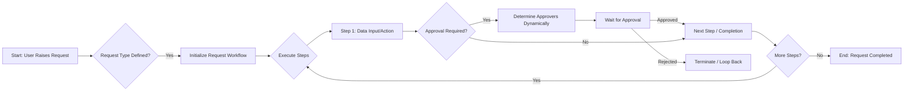
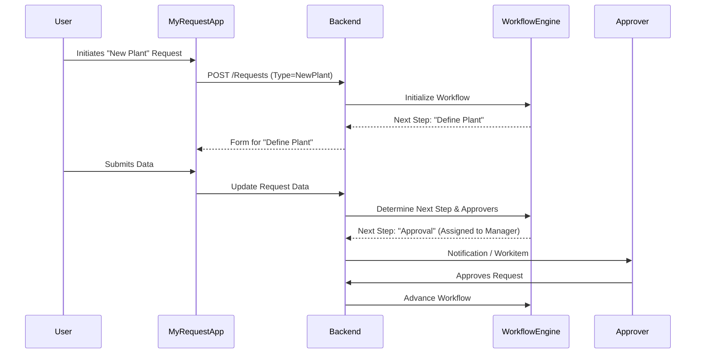

# Flexible Request Management System - Business Requirements

## 1. Document Overview

Project Name: Flexible Request Management System
Version: v1.0
Status: Draft
Date: 2026-01-02

## 2. Executive Summary & Business Objectives

Problem Statement: Current processes for business requests (purchasing, travelling, etc.) and governance processes (e.g., New Plant creation) are likely fragmented or rigid. There is a need for a unified, flexible system that can handle simple single-step requests as well as complex, multi-step governance workflows with dynamic data transfer and approval paths.

Business Goals:
- Unify various business request types into a single platform.
- Support complex governance processes (e.g., Plant Creation) with multi-step workflows.
- Enable dynamic configuration of workflows, approvers, and data schemas without code changes.
- Improve visibility and tracking of requests for end-users and management.

Target Audience:
- End Users: Employees raising requests (Purchasing, HR, Asset, etc.).
- Approvers: Managers and functional teams responsible for reviewing and approving steps.
- Administrators: Process owners defining request types and workflows.

## 3. Business Process Mapping

## 4. Functional Requirements

| ID | Feature | User Story | Acceptance Criteria | Priority |
| -- | ------- | ---------- | ------------------- | -------- |
| FR-01 | Request Creation | As an End User, I want to raise different types of requests (Purchasing, Travel, New Plant, etc.). | 1. User can select from configured request types.   2. Specific form fields display based on request type. | High |
| FR-02 | Dynamic Workflows | As an Admin, I want to configure multi-step processes for specific requests (e.g., Governance). | 1. Support definition of sequential or parallel steps.   2. Data from previous steps is available in subsequent steps. | High |
| FR-03 | Dynamic Approvals | As the System, I need to route approvals to the correct person or team based on request data (e.g., Plant ID). | 1. Approvers determined at runtime based on rules (e.g., Data content).   2. Support for individual or team approvers. | High |
| FR-04 | My Request App | As an End User, I want to view the status of my requests and pending actions. | 1. Worklist showing raised requests.   2. Detail view showing workflow progress and current status. | High |
| FR-05 | Approval App | As an Approver, I want to see a worklist of items requiring my attention. | 1. Unified inbox for all approval tasks.   2. Ability to Approve, Reject, or Send Back. | High |
| FR-06 | Request Type Admin | As an Admin, I want a "Design Studio" to configure request types visually. | 1. Drag-and-drop workflow builder.   2. **Field Configuration:** Define Data Types (Text, Number, Date, Boolean, User), Validations (Regex, Mandatory, Read-Only), and Logic (Visibility rules).   3. Status Network definition. | High |
| FR-07 | Status Network | As an Admin, I want to define the lifecycle valid statuses for a request. | 1. Configuration of start, intermediate, and end statuses. | Medium |
| FR-08 | Audit Trail | As a Compliance Officer, I want to see a full history of "Who did What and When" for every request. | 1. Chronological log of all status changes, approvals, and data edits.   2. Visible to authorized users on the Request Detail. | High |
| FR-09 | Workflow Visibility | As a User, I want to see the current step and all future pending steps. | 1. Visual indicator of "Where am I" in the process.   2. List of remaining steps and their estimated approvers. | High |
| FR-10 | Reminders | As the System, I want to send notifications for overdue steps. | 1. Configurable SLAs/Due Dates per step.   2. Automated emails/alerts to approvers when due date is passed. | Medium |
| FR-11 | Step Sub-Workflows | As an Admin, I want to configure multiple approvals for a single step. | 1. Define internal workflows within a step (e.g., A -> B -> C).   2. Step only completes when all internal approvals are done. | High |

## Non-Functional Requirements (NFRs)

- Auditability: The system must maintain an immutable log of all significant business actions (Create, Approve, Reject, Edit).
- Flexibility: The system must allow the addition of new request types and modification of workflows without code deployment.
- Usability: The "Design Studio" for Admins must provide a WYSIWYG experience to reduce configuration complexity.
- Performance: Dynamic determination of approvers and rendering of dynamic forms should likely occur within sub-second response times.
- Scalability: Support for complex nested workflows (Sub-workflows for steps).

## 6. System Interaction (High Level)

## 7. Constraints & Assumptions

Constraints:
    - Must integrate with existing SAP BTP services (likely).
    - Approval logic may require integration with SAP BPA or custom rule engine.

 Assumptions:
    - "Governance Processes" act as special types of Requests with more complex lifecycle needs.
    - Data schemas for different steps can be defined using JSON or similar dynamic structures.

## 8. Glossary

- Request Type: A category of business process (e.g., "Leave Request", "New Plant Governance").
- Step: A distinct unit of work within a Request, having its own status, data, and potential approval requirement.
- Governance Process: A complex request type involving multiple dependent steps and stakeholders.

## Appendix A: Reference Use Case - New Plant (Governance)

**Scenario:** The business needs to create a new manufacturing plant "P100". This requires info from Operations, Finance, and Logistics.

**Step Sequence:**

1.  **Initiation (Requester: Plant Manager)**
    *   *Action:* Fills basic info (Plant Name, Location, Country).
    *   *System:* Creates Request (Status: DRAFT -> SUBMITTED).

2.  **Define Plant (Approvers: Ops Director -> VP Manufacturing)**
    *   *Input:* Confirms capacity and calendar.
    *   *Sub-Workflow:*
        *   Approval 1: Ops Director checks capacity.
        *   Approval 2: VP Manufacturing signs off on location.
    *   *Output:* Plant ID generated (e.g., PLNT_1001).

3.  **Finance Setup (Approver: Regional Controller)**
    *   *Dependency:* Needs Plant ID from Step 2.
    *   *Input:* Assigns Company Code, Business Area, Profit Center.
    *   *Validation:* Company Code must exist in S/4HANA.

4.  **Logistics Setup (Approver: Supply Chain Lead)**
    *   *Parallel:* Can start once Step 2 is done (Parallel to Step 3).
    *   *Input:* Assigns Purchasing Org, Shipping Point.

5.  **Final Review (Approver: VP Operations)**
    *   *Dependency:* Steps 3 & 4 must be COMPLETE.
    *   *Action:* Final "Go/No-Go" approval.
    *   *System:* Triggers interface to S/4HANA to create the Plant master data.

*This use case validates: Dynamic Workflows, Data Passing between steps, Parallel execution, and Role-based assignments.*
