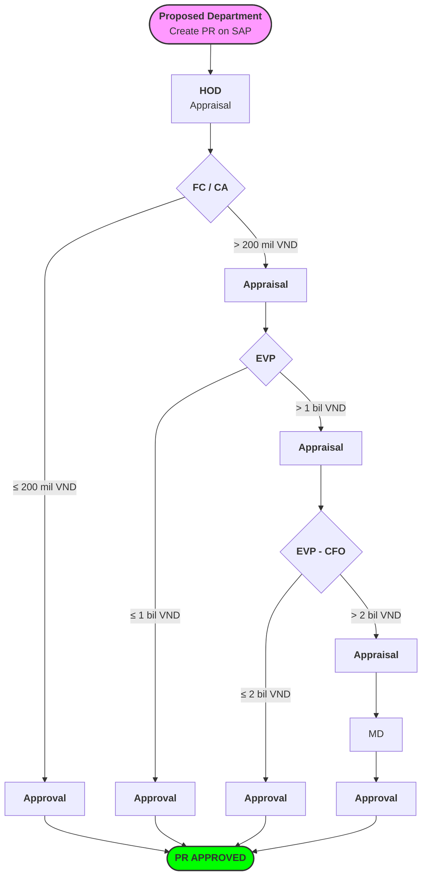

# 2 business use cases for workflow

we actually have 2 different business use cases

## [**1st busines use case**]: we can call it as "classical workflow"

In this use case, the workflow will have serveral "steps". But it is not neccessary to go thought all the steps, the workflow can stop in the midle depend on the conditions.

All the step in this worklow have the same Form Schema (or we can say, we have **only one Form Schema** which define from the beginning and unchanged for all the workflow **steps**).

**For example**: the common PR Approval for buying Fixed Assets (Software, construction, major repairs) as following:

- With this workflow, the request will create the PR by fill in the PR request form.

- Depend total value, the number of approver will be determined.

- After PR APPROVED, we will sync the data back to SAP backend.

- Example 1: user raise a request with total = 900 mil, then
  
  - approver 1 is: HOD
  
  - approver 2 is: FC / CA
  
  - approver 3 is: EVP -> this is also the final approver for this flow
  
  - The workflow will stop at this point. The data sync to backend will start to create the PR in S4 system.

- Example 2: user raise a request with total = 2,5 bil, then all the approvers have go thought, and the final approver is MD. The workflow will stop at this point. The data sync to backend will start to create the PR in S4 system.

## [**2rd business use case**]: we can call it as "governance workflow"

In this use case, the workflow will also have serveral **steps**.

The main different from previous use case is: each **step** may have different **Form Schema** and each step also may have different reviewer and approver

**For Example** requet new Plant. In this request, we have serveral steps, like

- Step 1: Define new Plant.
  
  - In this step: the Form Schema will have some fields like: plant number, plant description, language key, plant address, factory calendar ...
  
  - The reviewer of this step is Person A and the Approver is person B
  
  - After the approval give in this step, we may immediately sync the data to SAP S4 backend to create the plant.

- Step 2: Assign the Plant to company code the Purchasing Org.
  
  - In this step: the Form Schema will have some fields like: plant number (which is the number was created from step 1), company code, purchasing org ...
  
  - The reviewer of this step is Person C and the Approver is person D
  
  - After the approval give in this step, we may not sync the data to SAP backend, but wait for the next step finish and sync all data together.

- Step 3: Assign Sales Org and Distribution Channel to the Plant
  
  - In this step: the Form Schema will have some fields like: plant number (which is the number was created from step 1), sales org, distribution channel ..
  
  - The reviewer of this step is Person E and the Approver is person F
  
  - After the approval give in this step, we may sync the data of this step 3 and previous step 2 to SAP S4 backend together

- The workflow will end after all Steps finish. No any step can be skipped.
