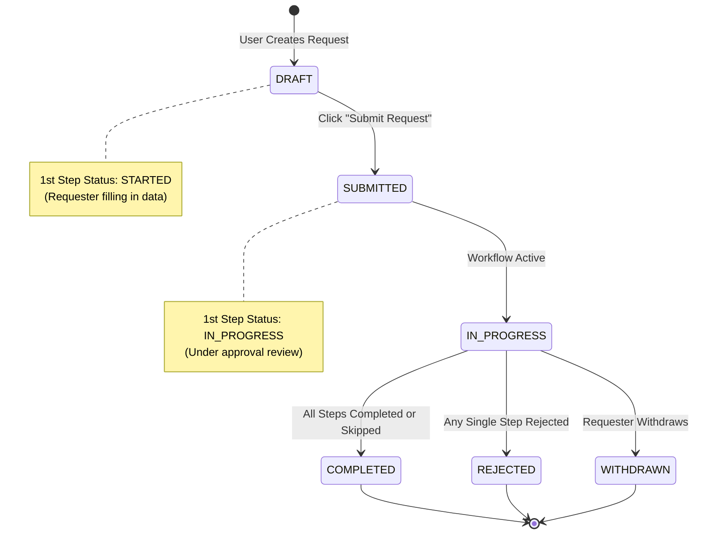
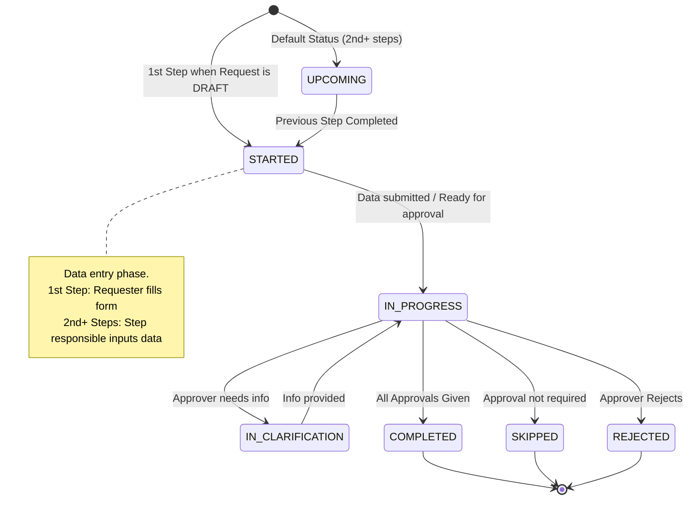
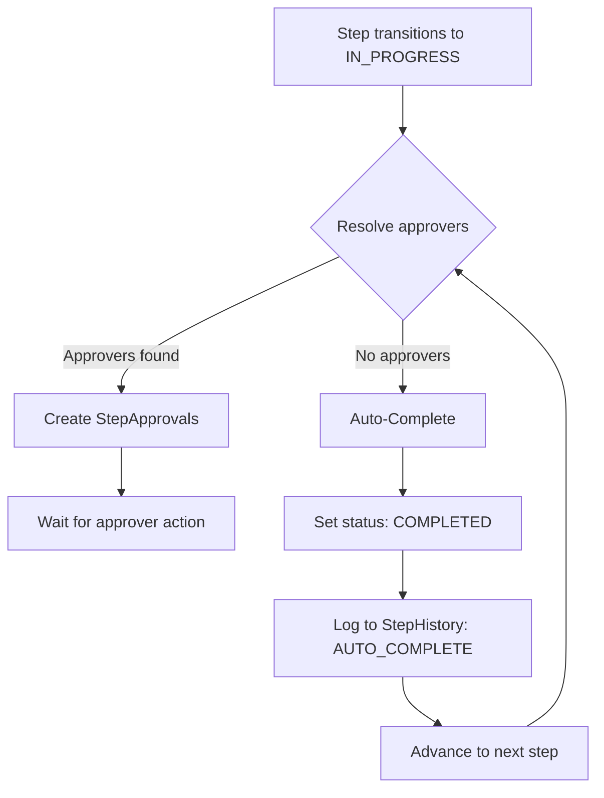

### 1. Request Status

| **Request Status** | **Explanation / Status meaning**                                                                                                                                                                                                                                                                                                                                                                                                                                                                                                                                                                                                                                                  |
| ------------------ | --------------------------------------------------------------------------------------------------------------------------------------------------------------------------------------------------------------------------------------------------------------------------------------------------------------------------------------------------------------------------------------------------------------------------------------------------------------------------------------------------------------------------------------------------------------------------------------------------------------------------------------------------------------------------------- |
| **DRAFT**          | This status means, Requester create new request but just save it as Draft. This is the default Status, when user start the creation of Request.                                                                                                                                                                                                                                                                                                                                                                                                                                                                                                                                   |
| **SUBMITTED**      | This status means, Requester already fill in all necessary information for the request, and he click button Submit Request.<br><br>According to our concept, when Requester submit the Request, the 1st Step transitions from `STARTED` to `IN_PROGRESS` (moving from data entry to approval phase). For the StepApprovals, in case the step needs several approvals, the 1st approver will have status `PENDING` (meaning the workflow is now on his hand). And the rest will have status `WAITING` (meaning they are waiting for the workflow to come to them).<br><br>**Note:** 1st Step is the step which has Step Definition `isStartStep = true` |
| **IN_PROGRESS**    | When not all steps are `COMPLETED` (or `SKIPPED`)                                                                                                                                                                                                                                                                                                                                                                                                                                                                                                                                                                                                                                 |
| **COMPLETED**      | When all steps have status `COMPLETED` or `SKIPPED`<br>**For example:**<br>step 1: `COMPLETED`<br>step 2: `SKIPPED`<br>step 3: `COMPLETED`<br>-> Request status is `COMPLETED`                                                                                                                                                                                                                                                                                                                                                                                                                                                                                                    |
| **REJECTED**       | When one step have status `REJECTED`.<br>Basically, when one step is `REJECTED`, then the workflow is end, even when we still have some UPCOMING steps after that.<br>**Question:** see question below, in Step Status `REJECTED`.                                                                                                                                                                                                                                                                                                                                                                                                                                                |
| **WITHDRAWN**      | After submit the Request, The requester may withdraw the request. The status when `WITHDRAWN` and the workflow end.                                                                                                                                                                                                                                                                                                                                                                                                                                                                                                                                                               |

Here is mermaid chart of Request Status



### 2. Step Status

| **Step Status**      | **Explanation / Status meaning**                                                                                                                                                                                                                                                                                                                                                                                                                                                     |
| -------------------- | ------------------------------------------------------------------------------------------------------------------------------------------------------------------------------------------------------------------------------------------------------------------------------------------------------------------------------------------------------------------------------------------------------------------------------------------------------------------------------------ |
| **UPCOMING**         | This is the default status of Step.                                                                                                                                                                                                                                                                                                                                                                                                                                                  |
| **IN_PROGRESS**      | This is the current running Step.                                                                                                                                                                                                                                                                                                                                                                                                                                                    |
| **COMPLETED**        | When all required approval given for this steps. Then this step is finish, and the next steps will have change from `UPCOMING` to `STARTED`<br>**For example:** with below workflow, when Step "Define Plant" is `COMPLETED`, then 2 parallel Steps: "Finance Review" and "Logistics Setup" will automatically change from `UPCOMING` to `STARTED`.<br/><br/> |
| **STARTED**          | With this status, the step responsible (maybe the same as the Requester, may be different) needs to input the data for this step.<br><br>**For 1st Step:** When requester creates a new request (Request Status: `DRAFT`), the 1st Step automatically gets status `STARTED` - the requester is filling in the form data.<br>**For 2nd+ Steps:** When the previous step is `COMPLETED`, subsequent parallel or sequential steps transition from `UPCOMING` to `STARTED`, waiting for the step responsible to input data. |
| **REJECTED**         | The approver Reject the step → step is `REJECTED`.<br><br>**Decision:** When any step is rejected, the entire Request status becomes `REJECTED`. See [Handling REJECTED Workflows](#handling-rejected-workflows) section below for detailed approach. |
| **SKIPPED**          | The approver may Skip the step if he thinks the approval is not required                                                                                                                                                                                                                                                                                                                                                                                                             |
| **IN_CLARIFICATION** | It mean the approver need more information from requester                                                                                                                                                                                                                                                                                                                                                                                                                            |

Here is the mermaid chart of Step Status



### 3. StepApprovals Status

| **StepApprovals Status** | **Explanation / Status meaning**                                        |
| ------------------------ | ----------------------------------------------------------------------- |
| **PENDING**              | This is the current approver. The workflow is on his hand               |
| **WAITING**              | He is waiting the workflow comes to him                                 |
| **APPROVED**             | He approved                                                             |
| **REJECTED**             | He rejected                                                             |
| **SENDBACK**             | He send back to the requester or step responsible for more information. |

---

## Auto-Complete for Steps Without Approval Rules

### Problem Statement

**Scenario:** A step has no approval rules defined.

**Issue:** If a step transitions to `IN_PROGRESS` but has no approvers, it would be stuck forever with no way to proceed to the next step.

### Solution: Automatic Step Completion

When the workflow engine detects that a step has **zero approval rules**, it automatically:

1. **Transitions step to `COMPLETED`** immediately after data submission
2. **Records step history** with action `AUTO_COMPLETE` and actor `system`
3. **Advances workflow** to the next step automatically
4. **Cascades through multiple auto-complete steps** if consecutive steps also have no approval rules

### Implementation Logic

**Trigger Points:**
- **Request Submission:** When requester submits request (1st step transitions from `STARTED` → `IN_PROGRESS`)
- **Workflow Advancement:** When any step completes and workflow advances to next step

**Auto-Complete Flow:**


### Use Cases

**Use Case 1: Pure Data Collection Steps**
```
Step 1: "Submit Request" (has approval rules) → Normal approval flow
Step 2: "Collect Additional Info" (no approval rules) → Auto-completes
Step 3: "Final Approval" (has approval rules) → Normal approval flow
```

**Use Case 2: System Integration Steps**
```
Step 1: "Manager Approval" (has approval rules) → Normal approval flow  
Step 2: "Sync to SAP" (no approval rules, system action) → Auto-completes
Step 3: "IT Provisioning" (has approval rules) → Normal approval flow
```

**Use Case 3: Cascading Auto-Complete**
```
Step 1: "Submit Request" (has approval rules) → Normal approval flow
Step 2: "Data Validation" (no approval rules) → Auto-completes
Step 3: "Enrichment" (no approval rules) → Auto-completes  
Step 4: "Director Approval" (has approval rules) → Normal approval flow

Result: Steps 2 & 3 complete instantly when Step 1 is approved
```

### Benefits

✅ **Prevents Workflow Deadlock:** No steps can be stuck indefinitely  
✅ **Flexible Design:** Allows pure data-entry or system-action steps  
✅ **Performance:** Reduces unnecessary manual intervention  
✅ **Audit Trail:** System actions are logged in StepHistory  

### Edge Cases Handled

| Edge Case | Behavior |
|-----------|----------|
| All steps have no approval rules | Entire workflow auto-completes immediately after submission |
| First step has no approval rules | Auto-completes on submission, advances to next step |
| Last step has no approval rules | Auto-completes, request marked `COMPLETED` |
| Mixed approval/no-approval steps | Only steps without rules auto-complete |

---

## Handling REJECTED Workflows

### Problem Statement

When a workflow step is rejected, a critical question arises:

**Example Scenario:**
```
Step 1: COMPLETED (backend sync already happened ✓)
Step 2: REJECTED (approver rejects)
Step 3: UPCOMING (never executed)
```

**Question:** Should the entire Request be marked as `REJECTED`? What happens to already-completed steps that may have triggered external systems?

### Chosen Approach: **Option A - Hard Rejection** ✅

**Implementation:**
- When any step is `REJECTED`, the Request status immediately becomes `REJECTED`
- All completed steps remain in their `COMPLETED` state (immutable)
- Any `UPCOMING` steps are never executed
- The request becomes final and cannot be resubmitted

**Rationale:**
1. **Simplicity**: Clear state machine with no complex compensation logic
2. **Immutability**: Completed steps cannot (and should not) be reverted
3. **Clear Outcome**: Request status `REJECTED` unambiguously communicates the final result
4. **Audit Trail**: History shows exactly what was completed before rejection
5. **Future Actions**: If needed, requester creates a new request

**Example Flow:**
```
1. User submits Access Request
2. Step 1 "Manager Approval": COMPLETED → Access provisioned in backend
3. Step 2 "Security Review": REJECTED → Security finds policy violation
4. Request Status: REJECTED
5. Result: Access was provisioned but request is marked rejected
   → Compensating action handled manually or via separate cleanup process
```

---

### Alternative Approaches (Future Consideration)

#### **Option B - Soft Rejection with Resubmission**

**Concept:**
- Request Status: `REJECTED`
- Add new action: **"Resubmit for Review"**
  - Creates new workflow instance (new Request ID)
  - Copies data from completed steps
  - Starts fresh from the rejected step
  - Original request remains `REJECTED` for audit

**Pros:**
- User-friendly: no need to re-enter all data
- Maintains audit trail of original rejection

**Cons:**
- More complex: need to handle data cloning
- Two requests in system for same intent
- Need to define which data gets copied

---

#### **Option C - Conditional Rollback with Compensating Actions**

**Concept:**
- Add `isReversible` flag to step schema
- If Step 1 has `isReversible: true`:
  - Trigger compensating action (e.g., deprovision access)
  - Allow re-submission from Step 1
- If Step 1 has `isReversible: false`:
  - Hard rejection (same as Option A)

**Pros:**
- Most flexible: supports reversible and non-reversible actions
- Can truly "undo" when possible

**Cons:**
- Most complex to implement
- Requires compensating action logic for each step type
- Potential for partial failures during rollback
- May not be feasible for external integrations (e.g., already synced to S/4HANA)

---

### Implementation Timeline

**Current (v1.0):**
- ✅ Implement **Option A - Hard Rejection**
- Simple, robust, handles all cases clearly

**Future Enhancements (v2.0+):**
- If user feedback indicates need for resubmission: Consider **Option B**
- If specific use cases require rollback: Evaluate **Option C** for those steps only

**Decision Point:**
Monitor real-world usage. If >20% of rejected requests lead to new request creation with same data, consider implementing Option B.
