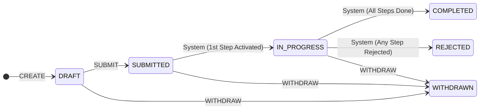
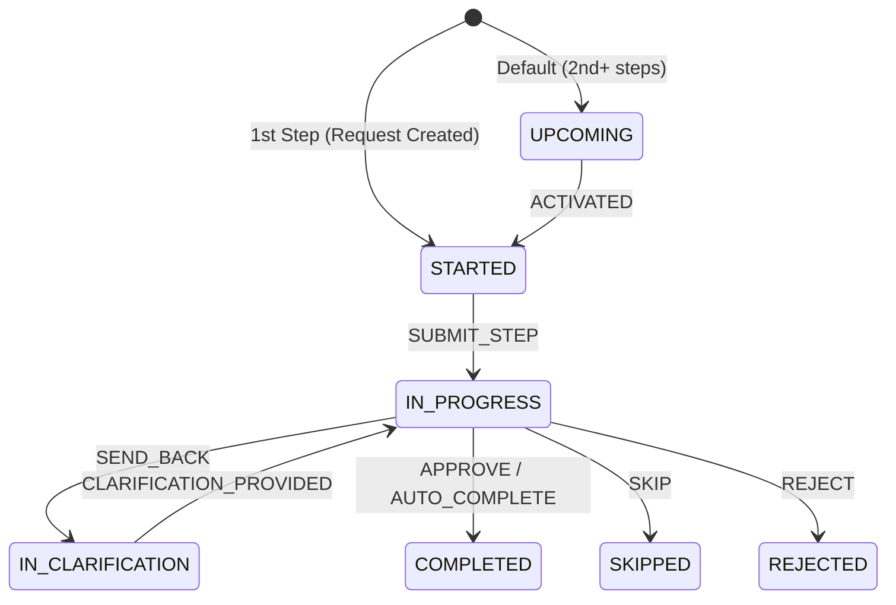

# Status & Action Model Reference

This document provides a complete picture of the **Statuses** and **Actions** at both the **Request** and **Step** levels, including the triggers that cause status transitions.

---

## Core Philosophy

> **Request = Container** | **Step = Execution Unit**

- A **Request** is a container that holds multiple **Steps**.
- **Actions** (Approve, Reject, Send Back, etc.) happen at the **Step** level.
- The **Request Status** is **derived** from the aggregated status of its Steps.
- The Request does not "self-approve" or "self-reject"—its fate is determined by its Steps.

---

## 1. Request Level

### 1.1 Request Statuses

| Status | Meaning | Derived From |
|--------|---------|--------------|
| `DRAFT` | Requester is filling in data. Not yet submitted. | Initial state |
| `SUBMITTED` | Requester clicked "Submit". Workflow is now active. | User action: Submit |
| `IN_PROGRESS` | At least one step is actively being worked on. | Any Step is `IN_PROGRESS` or `STARTED` |
| `COMPLETED` | All Steps are `COMPLETED` or `SKIPPED`. | All Steps terminal (success) |
| `REJECTED` | Any single Step is `REJECTED`. | Any Step is `REJECTED` |
| `WITHDRAWN` | Requester cancelled the request. | User action: Withdraw |

### 1.2 Request Actions (User-Triggered)

These are the **only** actions that logically belong at the Request level:

| Action | Description | Status Transition | Logged To |
|--------|-------------|-------------------|-----------|
| `CREATE` | User creates a new request | `null` → `DRAFT` | `RequestHistory` |
| `SUBMIT` | User submits the request | `DRAFT` → `SUBMITTED` | `RequestHistory` |
| `WITHDRAW` | User cancels the request | `*` → `WITHDRAWN` | `RequestHistory` |

### 1.3 Request Status Transitions (System-Derived)

These transitions are **not** user actions—they are **derived** from Step status changes:

| From | To | Trigger |
|------|-----|---------|
| `SUBMITTED` | `IN_PROGRESS` | First Step begins approval |
| `IN_PROGRESS` | `COMPLETED` | All Steps are `COMPLETED` or `SKIPPED` |
| `IN_PROGRESS` | `REJECTED` | Any Step is `REJECTED` |

---

## 2. Step Level

### 2.1 Step Statuses

| Status | Meaning |
|--------|---------|
| `UPCOMING` | Step is waiting for predecessor(s) to complete. |
| `STARTED` | Step is active for data entry (form filling). |
| `IN_PROGRESS` | Data submitted; awaiting approver decisions. |
| `IN_CLARIFICATION` | Approver requested more information. |
| `COMPLETED` | All required approvals granted. |
| `SKIPPED` | No approval required (or explicitly skipped). |
| `REJECTED` | Approver rejected the step. |

### 2.2 Step Actions (User & System Triggered)

| Action | Actor | Description | Status Transition | Logged To |
|--------|-------|-------------|-------------------|-----------|
| `ACTIVATED` | System | Previous step completed, this step becomes active. | `UPCOMING` → `STARTED` | `StepHistory` |
| `SUBMIT_STEP` | User (Requester/Responsible) | User submits data for approval. | `STARTED` → `IN_PROGRESS` | `StepHistory` |
| `APPROVE` | User (Approver) | Approver approves. | `IN_PROGRESS` → `COMPLETED` (if all approved) | `StepHistory` |
| `REJECT` | User (Approver) | Approver rejects. | `IN_PROGRESS` → `REJECTED` | `StepHistory` |
| `SEND_BACK` | User (Approver) | Approver requests clarification. | `IN_PROGRESS` → `IN_CLARIFICATION` | `StepHistory` |
| `CLARIFICATION_PROVIDED` | User (Requester) | Requester provides more info. | `IN_CLARIFICATION` → `IN_PROGRESS` | `StepHistory` |
| `AUTO_COMPLETE` | System | No approvers defined → auto-completes. | `IN_PROGRESS` → `COMPLETED` | `StepHistory` |
| `SKIP` | User/System | Step not required. | `IN_PROGRESS` → `SKIPPED` | `StepHistory` |

---

## 3. StepApproval Level

Each Step can have multiple Approvers. This level tracks individual approver decisions.

### 3.1 StepApproval Statuses

| Status | Meaning |
|--------|---------|
| `PENDING` | This approver is currently active. Waiting for their decision. |
| `WAITING` | This approver is in the queue (sequential approval). |
| `APPROVED` | This approver approved. |
| `REJECTED` | This approver rejected. |
| `SENDBACK` | This approver sent back for clarification. |
| `REAPPROVAL_NEEDED` | **(NEW)** This approver previously approved, but now must re-approve after clarification. |

---

## 4. Summary: Where to Log Each Action

| Action | Level | Log Target |
|--------|-------|------------|
| `CREATE` | Request | `RequestHistory` |
| `SUBMIT` | Request | `RequestHistory` |
| `WITHDRAW` | Request | `RequestHistory` |
| `STATUS_CHANGE` (Request) | Request | `RequestHistory` |
| `ACTIVATED` | Step | `StepHistory` |
| `SUBMIT_STEP` | Step | `StepHistory` |
| `APPROVE` | Step | `StepHistory` |
| `REJECT` | Step | `StepHistory` |
| `SEND_BACK` | Step | `StepHistory` |
| `CLARIFICATION_PROVIDED` | Step | `StepHistory` |
| `AUTO_COMPLETE` | Step | `StepHistory` |
| `SKIP` | Step | `StepHistory` |
