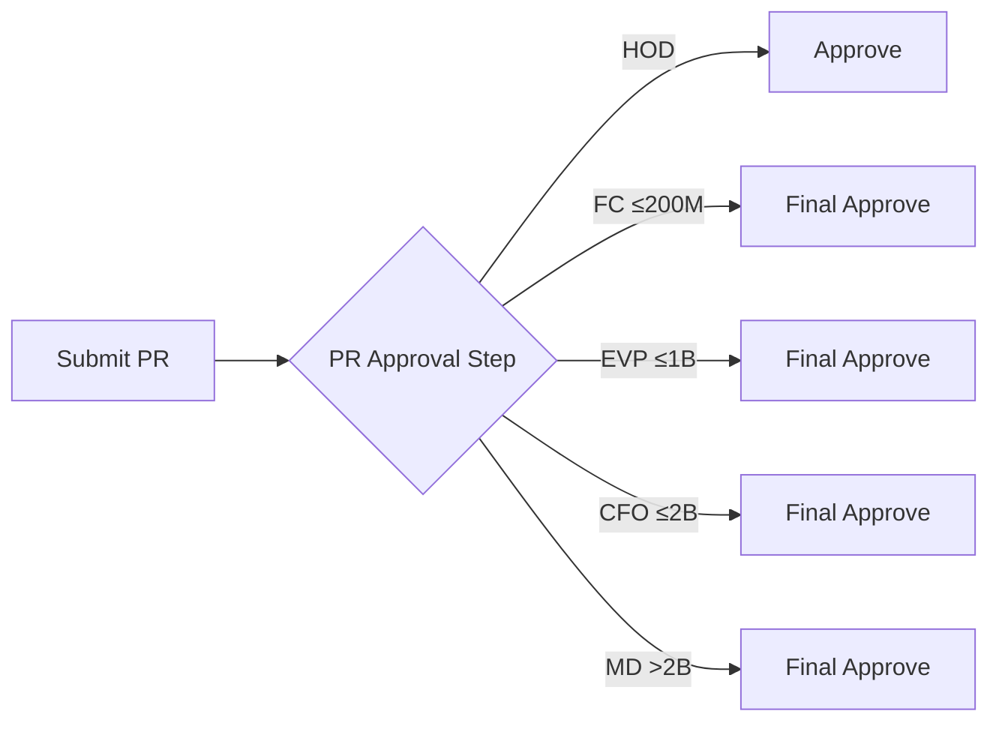

# Unified Workflow Model

> **Simplified Architecture** - One engine, flexible configuration

---

## Core Concept

**Everything is a "Governance Workflow"** with varying complexity:

| Configuration | Use Case | Steps | Schema |
|---------------|----------|-------|--------|
| 1 step + multiple approvers | Classical (PR Approval) | 1 | Single form |
| N steps + 1 approver each | Governance (New Plant) | N | Form per step |

```
┌─────────────────────────────────────────────────────────────────┐
│  UNIFIED ENGINE                                                  │
│                                                                  │
│  Classical Workflow = Governance with 1 step                    │
│  Mixed Workflow = Governance with all CUSTOM schemas            │
│                                                                  │
│  Same code path. Different configuration.                       │
└─────────────────────────────────────────────────────────────────┘
```

---

## Configuration Patterns

### Pattern 1: Classical Workflow (PR Approval)

**1 Step + Conditional Approvers**



**Configuration:**
```
RequestType: PR Approval
└── Step 1: "Create PR Request"
    └── ApproverRules:
        ├── Rule 1: HOD (always, not final)
        ├── Rule 2: FC (value ≤ 200M, isFinal=true)
        ├── Rule 3: EVP (value ≤ 1B, isFinal=true)
        ├── Rule 4: CFO (value ≤ 2B, isFinal=true)
        └── Rule 5: MD (value > 2B, isFinal=true)
```

### Pattern 2: Governance Workflow (New Plant)

**N Steps + Sequential Approvers**


**Configuration:**
```
RequestType: New Plant
├── Step 1: "Define Plant" (schemaContent: plant fields)
├── Step 2: "Assign Company" (schemaContent: company fields)
└── Step 3: "Assign Sales Org" (schemaContent: sales fields)
```

---

## Schema Enhancement

### ApproverRules (Enhanced)

```cds
entity ApproverRules : cuid {
    stepDefinition : Association to StepDefinitions;
    priority       : Integer;           // Evaluation order
    conditionExpr  : LargeString;       // When this rule applies
    approverType   : String enum { USER; ROLE; REQUESTER_MANAGER };
    approverValue  : String;
    isFinal        : Boolean default false;  // 🆕 Stop chain if approved
}
```

### Execution Logic

```typescript
async resolveApprovers(stepId: string, payload: object): string[] {
    const rules = await SELECT.from(ApproverRules)
        .where({ stepDefinition_ID: stepId })
        .orderBy('priority');

    const approvers = [];
    for (const rule of rules) {
        if (evaluateCondition(rule.conditionExpr, payload)) {
            approvers.push(rule.approverValue);
            if (rule.isFinal) break;  // Stop adding approvers
        }
    }
    return approvers;
}
```

---

## Simplified Decision Tree

```
Creating a new Request Type?
         │
         ▼
   How many steps?
         │
    ┌────┴────┐
    │         │
    ▼         ▼
  1 step    2+ steps
    │         │
    ▼         ▼
 Configure   Configure
 ApproverRules  each step's
 with conditions  schema
    │         │
    └────┬────┘
         ▼
   Done! Same engine.
```

---

## Comparison with SAP MDG

| Capability | Our App | SAP MDG | Notes |
|------------|---------|---------|-------|
| Simple workflows | ✅ | ✅ | Equal |
| Dynamic forms | ✅ | ✅ | Equal |
| Conditional approvers | ✅ | ✅ | Equal |
| S/4 Integration | ✅ | ✅ | Equal |
| Complex Material Master | ❌ | ✅ | Use MDG |
| Mass processing | ❌ | ✅ | Use MDG |
| Duplicate check | ❌ | ✅ | Use MDG |

**Positioning:** Lightweight alternative for 80% of use cases with 20% complexity.

---

## Migration from Two-Pattern Model

| Old Concept | New Concept |
|-------------|-------------|
| Classical Workflow | 1 step with conditional ApproverRules |
| Governance Workflow | N steps with custom schemas |
| INHERIT schemaMode | Remove - just use CUSTOM always |
| Mixed mode | Use Governance approach (all CUSTOM) |

---

## Benefits

1. **Simpler code** - One workflow engine, no branching
2. **Flexible UI** - Same Studio for all request types
3. **Easy to understand** - "How many steps? How many approvers?"
4. **Future-proof** - Supports any combination

---

**Created:** 2026-01-09  
**Authors:** Solution Architect + User Discussion
