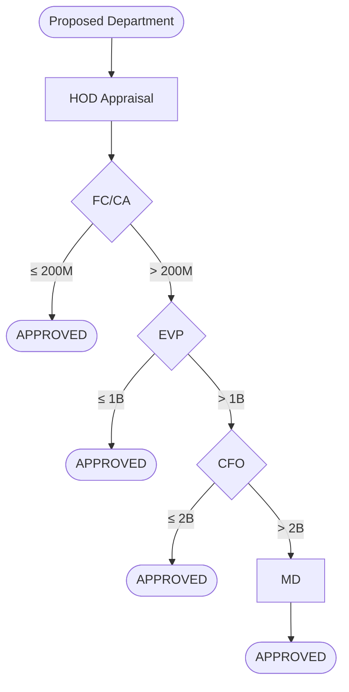
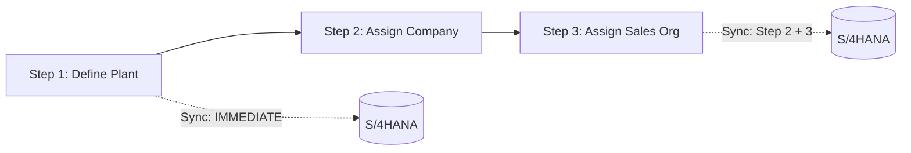
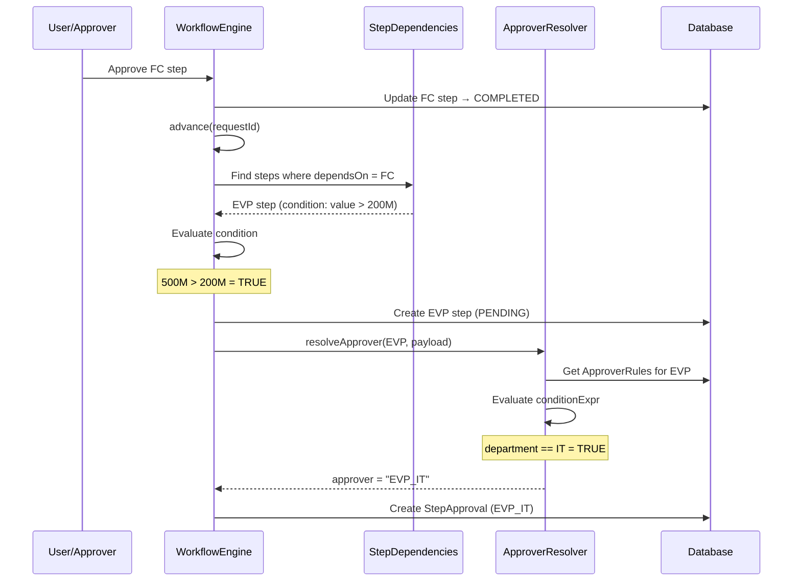
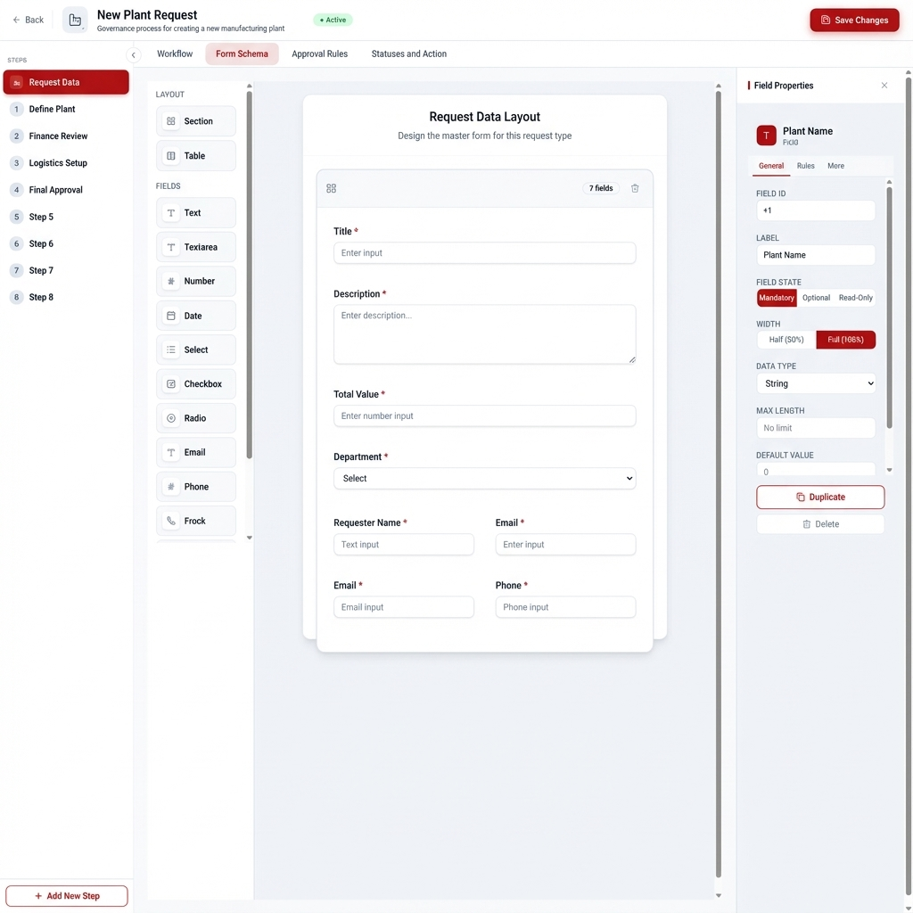
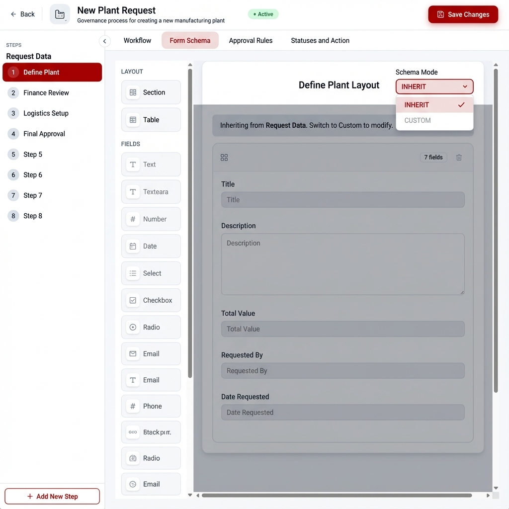
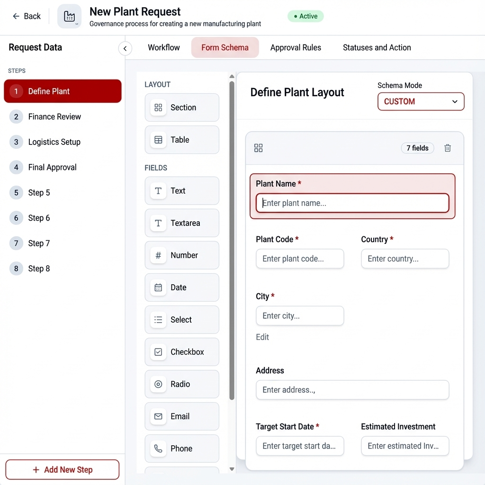
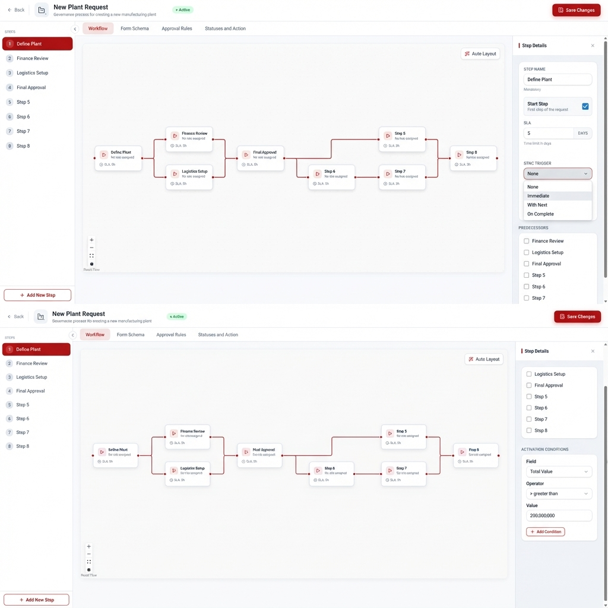

# Workflow Enhancement Concepts

> **Reference Document** for Classical and Governance Workflow patterns

---

## 📚 Table of Contents

1. [Two Workflow Patterns](#two-workflow-patterns)
2. [Master Schema Concept](#master-schema-concept)
3. [Master Data Concept](#master-data-concept)
4. [Conditional Dependencies](#conditional-dependencies)
5. [Sync Trigger Concept](#sync-trigger-concept)
6. [Configuration Examples](#configuration-examples)
7. [UI Mockups](#ui-mockups)

---

## Two Workflow Patterns

| Pattern | Use Case | Schema | Data | Steps |
|---------|----------|--------|------|-------|
| **Classical Workflow** | PR Approval | Single for all | Single for all | Can exit early |
| **Governance Workflow** | New Plant | Different per step | Different per step | All mandatory |

### Classical Workflow Example



### Governance Workflow Example



---

## Master Schema Concept

**Problem:** In Classical Workflow, all steps use the same form. Without master schema, admin must copy paste the schema JSON to every step.

**Solution:** Store schema once at `RequestTypes.masterSchema`, steps inherit it.

### Schema Definition

```cds
entity RequestTypes : cuid, managed {
    // ... existing fields ...
    masterSchema : LargeString;  // 🔵 Single schema for all steps
}

entity StepDefinitions : cuid, managed {
    // ... existing fields ...
    schemaMode : String enum {
        INHERIT;  // Use RequestType.masterSchema
        CUSTOM;   // Use own schemaContent
    } default 'INHERIT';
}
```

### How It Works

| schemaMode | Behavior |
|------------|----------|
| `INHERIT` | UI reads schema from `RequestType.masterSchema` |
| `CUSTOM` | UI reads schema from `StepDefinitions.schemaContent` |

---

## Master Data Concept

**Problem:** In Classical Workflow, user fills the same form at each step. Without master data, each step stores its own copy → data drift risk.

**Solution:** Store data once at `RequestMasterData.payload`, all steps share it.

### Schema Definition

```cds
entity RequestMasterData : cuid, managed {
    request : Association to Requests;  // 🟢 One per Request
    payload : LargeString;              // The JSON values
}
```

## Master Schema and Master Data Visualization

```
┌──────────────────────────────────────────────────────────────────┐
│                                                                   │
│  CONFIGURATION:                                                   │
│  ┌─────────────────┐                                             │
│  │  RequestTypes   │                                             │
│  │  masterSchema ──┼──► "{ title, totalValue, ... }"            │
│  └─────────────────┘                                             │
│         │                                                         │
│         ▼                                                         │
│  ┌─────────────────┐  ┌─────────────────┐  ┌─────────────────┐  │
│  │  Step 1 (HOD)   │  │  Step 2 (FC)    │  │  Step 3 (EVP)   │  │
│  │  schemaMode:    │  │  schemaMode:    │  │  schemaMode:    │  │
│  │  INHERIT        │  │  INHERIT        │  │  INHERIT        │  │
│  └─────────────────┘  └─────────────────┘  └─────────────────┘  │
│                                                                   │
│  ─────────────────────────────────────────────────────────────── │
│                                                                   │
│  RUNTIME:                                                         │
│  ┌─────────────────────────────────────────────────────────────┐ │
│  │  Request #123                                                │ │
│  │  ┌────────────────────────────────────────────────────────┐  │ │
│  │  │  RequestMasterData                                     │  │ │
│  │  │  payload: { "title": "Buy Laptop", "totalValue": 500M }│  │ │
│  │  └────────────────────────────────────────────────────────┘  │ │
│  │                         ↓ shared by                          │ │
│  │  ┌────────┐  ┌────────┐  ┌────────┐                         │ │
│  │  │ Step 1 │  │ Step 2 │  │ Step 3 │  (no per-step data)    │ │
│  │  └────────┘  └────────┘  └────────┘                         │ │
│  └─────────────────────────────────────────────────────────────┘ │
└──────────────────────────────────────────────────────────────────┘
```
---

## Conditional Dependencies

**Problem:** In Classical Workflow, not all steps execute. Which steps run depends on request data (e.g., total value).

**Solution:** Add `condition` field to existing `StepDependencies` entity.

### Schema Definition

```cds
entity StepDependencies : cuid {
    step        : Association to StepDefinitions;  // This step...
    dependsOn   : Association to StepDefinitions;  // ...waits for this
    condition   : LargeString;  // 🆕 Only follow if TRUE (null = always)
}
```

### Execution Flow

```
┌─────────────────────────────────────────────────────────────────┐
│  Previous Step Completed → WorkflowEngine.advance()             │
└─────────────────────────────────────────────────────────────────┘
                               │
                               ▼
               ┌───────────────────────────────┐
               │  For each StepDependency:     │
               │  Evaluate condition against   │
               │  RequestMasterData.payload    │
               └───────────────────────────────┘
                               │
               ┌───────────────┴───────────────┐
               ▼                               ▼
   ┌───────────────────┐           ┌───────────────────┐
   │  Condition TRUE   │           │  Condition FALSE  │
   │  or NULL          │           │                   │
   └───────────────────┘           └───────────────────┘
               │                               │
               ▼                               ▼
   ┌───────────────────┐           ┌───────────────────┐
   │  CREATE step      │           │  Do NOT create    │
   │  Evaluate         │           │  (path not taken) │
   │  approverRules    │           └───────────────────┘
   └───────────────────┘
```

### Condition Format

Same JSON format as `approverRules.conditionExpr`:

```json
{
  "field": "totalValue",
  "operator": "gt",
  "value": 200000000
}
```

**Supported operators:** `eq`, `ne`, `gt`, `lt`, `gte`, `lte`, `contains`, `in`, `exists`

### Conditional Dependencies vs ApproverRules

| Mechanism | Question | When Evaluated |
|-----------|----------|----------------|
| **condition** (StepDependencies) | "Should this step exist?" | Before step creation |
| **approverRules** | "Who approves this step?" | After step creation |

### Complete Execution Flow Visualization

```
┌─────────────────────────────────────────────────────────────────────────────────┐
│                     WORKFLOW ENGINE: advance(requestId)                          │
├─────────────────────────────────────────────────────────────────────────────────┤
│                                                                                  │
│  ① PREVIOUS STEP COMPLETED (e.g., FC approved)                                  │
│     └── Request payload: { "totalValue": 500000000, "department": "IT" }        │
│                                                                                  │
│  ────────────────────────────────────────────────────────────────────────────── │
│                                                                                  │
│  ② FIND NEXT STEPS (from StepDependencies where dependsOn = FC)                │
│     ┌────────────────────────────────────────────────────────────────────────┐  │
│     │  StepDependency:                                                       │  │
│     │    step      = EVP                                                     │  │
│     │    dependsOn = FC                                                      │  │
│     │    condition = {"field": "totalValue", "op": "gt", "value": 200M}     │  │
│     └────────────────────────────────────────────────────────────────────────┘  │
│                                                                                  │
│  ────────────────────────────────────────────────────────────────────────────── │
│                                                                                  │
│  ③ EVALUATE CONDITION                                                           │
│     ┌────────────────────────────────────────────────────────────────────────┐  │
│     │  Is totalValue (500M) > 200M?                                          │  │
│     │  → TRUE ✓                                                              │  │
│     └────────────────────────────────────────────────────────────────────────┘  │
│                                                                                  │
│  ────────────────────────────────────────────────────────────────────────────── │
│                                                                                  │
│  ④ CREATE STEP (because condition = TRUE)                                       │
│     ┌────────────────────────────────────────────────────────────────────────┐  │
│     │  INSERT INTO Steps:                                                    │  │
│     │    request_ID        = #123                                            │  │
│     │    stepDefinition_ID = EVP                                             │  │
│     │    status            = PENDING                                         │  │
│     │    dueDate           = NOW + slaDays                                   │  │
│     └────────────────────────────────────────────────────────────────────────┘  │
│                                                                                  │
│  ────────────────────────────────────────────────────────────────────────────── │
│                                                                                  │
│  ⑤ RESOLVE APPROVER (ApproverRules for EVP step)                               │
│     ┌────────────────────────────────────────────────────────────────────────┐  │
│     │  ApproverRule 1:                                                       │  │
│     │    conditionExpr = {"field": "department", "op": "eq", "value": "IT"} │  │
│     │    approverType  = ROLE                                                │  │
│     │    approverValue = "EVP_IT"                                            │  │
│     │                                                                        │  │
│     │  Is department (IT) == IT?                                             │  │
│     │  → TRUE ✓ → Assign "EVP_IT"                                           │  │
│     └────────────────────────────────────────────────────────────────────────┘  │
│                                                                                  │
│  ────────────────────────────────────────────────────────────────────────────── │
│                                                                                  │
│  ⑥ CREATE STEP APPROVAL                                                         │
│     ┌────────────────────────────────────────────────────────────────────────┐  │
│     │  INSERT INTO StepApprovals:                                            │  │
│     │    step_ID     = (newly created EVP step)                              │  │
│     │    approver    = "EVP_IT"                                              │  │
│     │    status      = PENDING                                               │  │
│     └────────────────────────────────────────────────────────────────────────┘  │
│                                                                                  │
└─────────────────────────────────────────────────────────────────────────────────┘
```

### Sequence Diagram




---

## Sync Trigger Concept

**Problem:** Need to sync data to S/4HANA at different points depending on business requirement.

**Solution:** Add `syncTrigger` field to `StepDefinitions`.

### Schema Definition

```cds
entity StepDefinitions : cuid, managed {
    // ... existing fields ...
    syncTrigger : String enum {
        NONE;         // Don't sync after this step
        IMMEDIATE;    // Sync right after approval
        WITH_NEXT;    // Wait, sync with next step
        ON_COMPLETE;  // Sync when entire workflow completes
    } default 'NONE';
}
```

### Example

| Step | syncTrigger | Behavior |
|------|-------------|----------|
| Define Plant | IMMEDIATE | Create plant in S/4 immediately |
| Assign Company | WITH_NEXT | Hold, sync with next step |
| Assign Sales Org | IMMEDIATE | Sync this + previous step together |

---

## Configuration Examples

### Classical Workflow: PR Approval

**RequestType:**
```json
{
  "title": "PR Approval",
  "masterSchema": "{ properties: { title, totalValue, department, ... } }"
}
```

**Steps:**

| Step | schemaMode | isStartStep | predecessors |
|------|------------|-------------|--------------|
| HOD | INHERIT | true | — |
| FC | INHERIT | false | HOD (no condition) |
| EVP | INHERIT | false | FC → condition: `value > 200M` |
| CFO | INHERIT | false | EVP → condition: `value > 1B` |
| MD | INHERIT | false | CFO → condition: `value > 2B` |

### Governance Workflow: New Plant

**RequestType:**
```json
{
  "title": "New Plant",
  "masterSchema": null
}
```

**Steps:**

| Step | schemaMode | schemaContent | syncTrigger |
|------|------------|---------------|-------------|
| Define Plant | CUSTOM | `{ plant, country, ... }` | IMMEDIATE |
| Assign Company | CUSTOM | `{ plant, companyCode, ... }` | WITH_NEXT |
| Assign Sales Org | CUSTOM | `{ plant, salesOrg, ... }` | IMMEDIATE |
---

## UI Mockups

### Form Schema Tab Enhancements


**1. Request Data Selected (Master Schema)**

When "Request Data" is selected, admin designs the master schema that will be shared across all steps in Classical Workflow.


<!-- slide -->
**2. Step with INHERIT Mode**

When a step is selected with Schema Mode = "INHERIT", the master schema is shown in read-only mode.


<!-- slide -->
**3. Step with CUSTOM Mode**

When a step is selected with Schema Mode = "CUSTOM", full form builder is enabled (for Governance Workflow).




### Workflow Tab Enhancements

The Step Details panel is enhanced with:
- **Sync Trigger** dropdown
- **Activation Conditions** builder



---

## Related Documents

- [2 Business Use Cases](2%20business%20use%20case%20for%20workflow.md)
- [Backend Guidelines](../../.agent/guidelines/backend-guidelines.md)
- [Status & Action Concept](../../.agent/general%20concepts/status-action-concept.md)

---

**Created:** 2026-01-07  
**Author:** Solution Architect (AI Agent Team)
