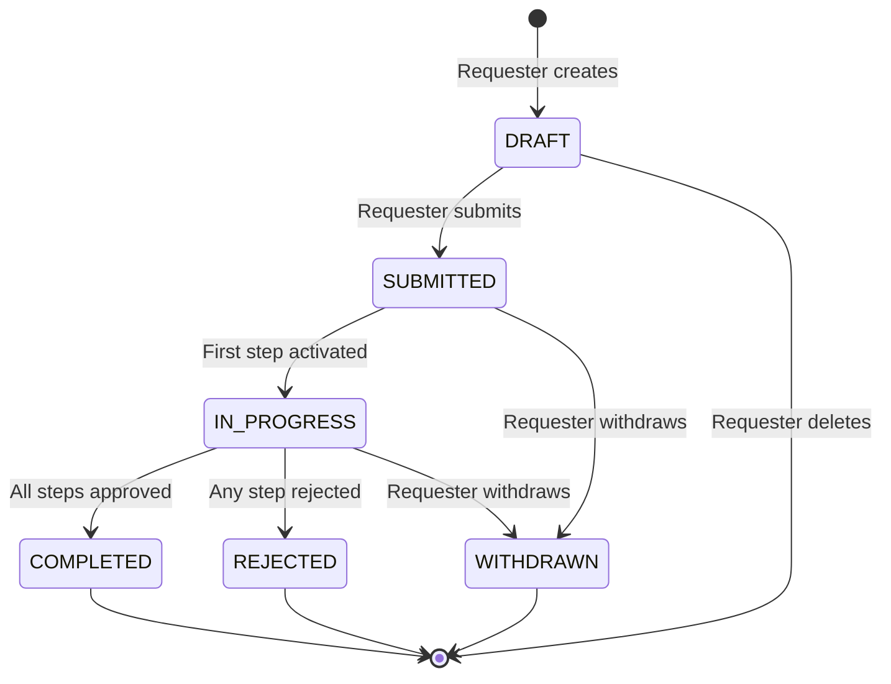
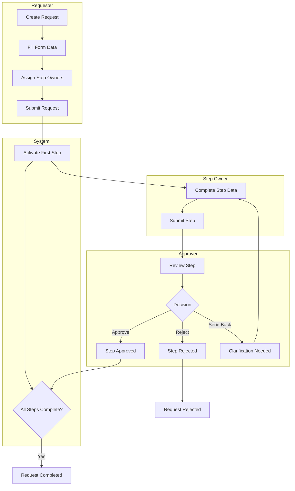

# Request Lifecycle

> **Owner:** BA Lead | **Last Updated:** 2026-01-17 | **Audience:** Business Analysts

This document describes the complete lifecycle of a request from creation to completion.

---

## Status Diagram

---

## Status Definitions

| Status | Description | Who Can See |
|--------|-------------|-------------|
| **DRAFT** | Request created but not submitted | Creator, Coordinator |
| **SUBMITTED** | Request submitted, waiting for processing | All assigned parties |
| **IN_PROGRESS** | At least one step is being worked on | All assigned parties |
| **COMPLETED** | All steps approved successfully | All assigned parties |
| **REJECTED** | At least one step was rejected | All assigned parties |
| **WITHDRAWN** | Requester cancelled the request | All assigned parties |

---

## Transitions

| From | To | Trigger | Who Can Do |
|------|-----|---------|------------|
| - | DRAFT | Create request | Requester |
| DRAFT | SUBMITTED | Submit request | Requester |
| SUBMITTED | IN_PROGRESS | System activates first step | System (automatic) |
| SUBMITTED | WITHDRAWN | Withdraw request | Requester |
| IN_PROGRESS | COMPLETED | All steps done | System (automatic) |
| IN_PROGRESS | REJECTED | Any step rejected | System (automatic) |
| IN_PROGRESS | WITHDRAWN | Withdraw request | Requester |

---

## Process Flow (Swimlane)

---

## Related Documents

- [Approval Flow](./approval-flow.md) - Detailed approval process
- [Claim Mechanism](./claim-mechanism.md) - Group assignment handling
