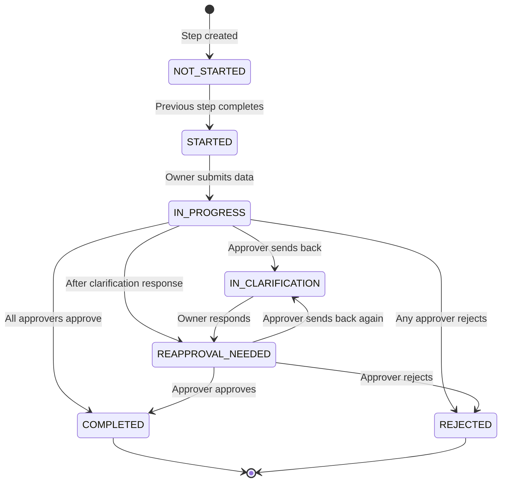
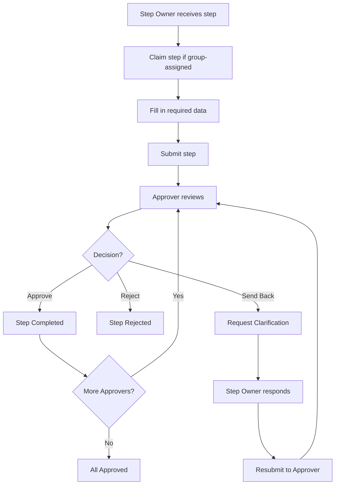

# Approval Flow

> **Owner:** BA Lead | **Last Updated:** 2026-01-17 | **Audience:** Business Analysts

This document describes how approval works for each step in a request.

---

## Step Status Diagram

---

## Step Status Definitions

| Status | Description | Active Party |
|--------|-------------|--------------|
| **NOT_STARTED** | Waiting for previous steps | None |
| **STARTED** | Ready for step owner | Step Owner |
| **IN_PROGRESS** | Data submitted, waiting approval | Approver |
| **IN_CLARIFICATION** | Approver requested changes | Step Owner |
| **REAPPROVAL_NEEDED** | Clarification provided | Approver |
| **COMPLETED** | Approved by all approvers | None |
| **REJECTED** | Rejected by any approver | None |

---

## Approval Process Flow

---

## Multi-Approver Scenarios

| Scenario | Behavior |
|----------|----------|
| Sequential approvers | Each approver reviews in order |
| Any approver rejects | Step is immediately rejected |
| All approvers approve | Step is completed |
| One approver sends back | Step goes to clarification |

---

## Related Documents

- [Request Lifecycle](./request-lifecycle.md) - Overall request flow
- [Claim Mechanism](./claim-mechanism.md) - How claiming works
