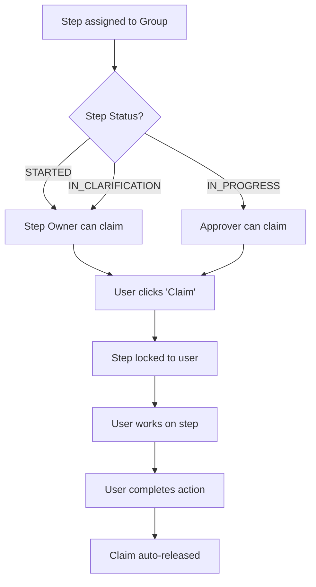

# Claim Mechanism

> **Owner:** BA Lead | **Last Updated:** 2026-01-17 | **Audience:** Business Analysts

This document explains how the claim mechanism works when steps are assigned to groups.

---

## Why Claiming?

When a step is assigned to a **group** (not an individual):
- Multiple people could work on it simultaneously
- Risk of duplicate or conflicting work
- Need a way to "lock" the step for one person

**Solution:** Claim mechanism allows one person to claim ownership temporarily.

---

## Claim Flow

---

## Claim Rules

### Who Can Claim

| Step Status | Who Can Claim | Why |
|-------------|---------------|-----|
| STARTED | Step Owners only | Owner needs to fill data |
| IN_PROGRESS | Approvers only | Approver needs to review |
| IN_CLARIFICATION | Step Owners only | Owner needs to respond |
| REAPPROVAL_NEEDED | Approvers only | Approver needs to re-review |

### Lane-Crossing Prevention

> **Important:** Step Owners cannot claim steps in approval status, and Approvers cannot claim steps in owner status.

This prevents confusion about who should be working on the step.

---

## Claim Lifecycle

| Event | Result |
|-------|--------|
| User claims step | Step locked, others see "Claimed by [Name]" |
| User completes action | Claim auto-released |
| User manually releases | Claim released, others can claim |
| 4 hours pass (timeout) | Claim automatically expires |
| Coordinator force-releases | Claim released regardless of owner |

---

## Visual Indicators

| User sees... | Step is... |
|--------------|------------|
| "Claim" button | Available to claim |
| "Claimed by [Name]" | Claimed by someone else |
| "Release" button | Claimed by current user |

---

## Timeout Behavior

**Design:** 4-hour claim timeout (lazy release)

- If a user claims and abandons the step
- The step shows as "claimed" for up to 4 hours
- When another user tries to claim, the expired claim is released

---

## Force-Release

**Who can force-release a claim:**
- The original claimer
- The request Coordinator
- System Administrators

**When to use:**
- Claimer is unavailable (sick, vacation)
- Step urgent and claimer unresponsive

---

## Related Documents

- [Request Lifecycle](./request-lifecycle.md)
- [Approval Flow](./approval-flow.md)
