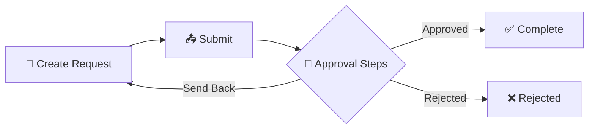

# Getting Started

> **Last Updated:** 2026-01-17

Welcome to the Flexible Request Management application. This guide will help you understand what the application does and how to get started.

---

## What is Flexible Request Management?

Flexible Request Management is an enterprise application for managing approval workflows. It allows organizations to:

- **Create custom request types** with configurable forms
- **Define multi-step approval workflows** with rules-based routing
- **Assign approvers** to individuals, groups, or roles
- **Track request status** from submission to completion

---

## Key Features

| Feature | Description |
|---------|-------------|
| **Request Types** | Custom forms with dynamic fields |
| **Workflow Steps** | Sequential or parallel approval flows |
| **Group Approvals** | Assign to teams, any member can approve |
| **Audit Trail** | Full history of all actions |
| **Visibility Control** | See only what you're authorized to see |

---

## How It Works

---

## User Roles

| Role | What You Can Do |
|------|-----------------|
| **Requester** | Create and submit requests |
| **Approver** | Review and approve/reject requests |
| **Coordinator** | Manage workflow and reassign owners |
| **Administrator** | Configure request types and manage users |

---

## Next Steps

- [Quick Start](./quick-start.md) - Create your first request in 5 minutes
- [Creating Requests](./user-manual/creating-requests.md) - Detailed guide
- [FAQ](./faq.md) - Common questions answered
