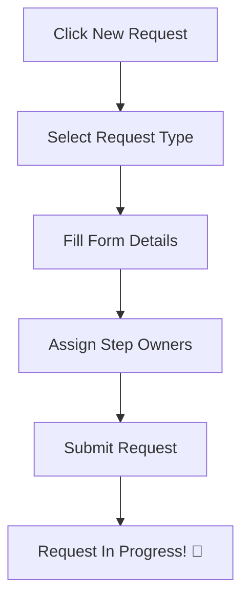

# Quick Start Guide

Get started with Flexible Request Management in 5 minutes.

---

## Step 1: Log In

1. Navigate to the application URL
2. Sign in with your company credentials (SSO)
3. You'll be redirected to your **Inbox**

---

## Step 2: Create Your First Request

1. Click **"New Request"** button
2. Select a request type (e.g., "New Plant Request")
3. Fill in the required information:
   - **Title** - A descriptive name
   - **Justification** - Why is this needed?
4. Assign step owners for each workflow step
5. Click **"Submit Request"**

---

## Step 3: Check Your Inbox

Your **Inbox** shows all tasks assigned to you:

| Tab | Content |
|-----|---------|
| **My Tasks** | Steps where you are the owner |
| **Approvals** | Steps waiting for your approval |

---

## Step 4: Complete a Task

1. Click on a task from your inbox
2. Review the request details
3. Complete the required action:
   - **As Step Owner**: Fill in the form and click "Submit"
   - **As Approver**: Review and click "Approve", "Reject", or "Send Back"

---

## Common Actions

| Action | Who Can Do It | When |
|--------|---------------|------|
| Create Request | Requester | Anytime |
| Submit Step | Step Owner | When step is assigned to you |
| Approve/Reject | Approver | When step is in approval |
| Send Back | Approver | When clarification needed |

---

## Next Steps

- Learn about [Creating Requests](../features/creating-requests.md) in detail
- Understand [Your Role](../security/understanding-roles.md)
