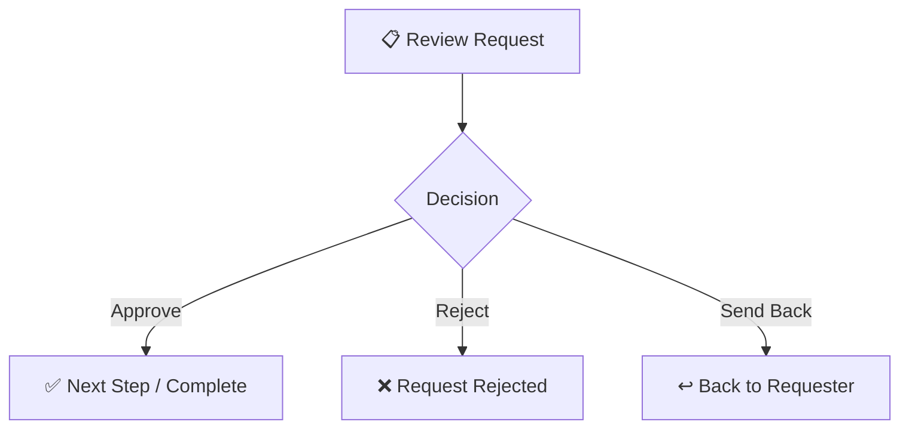

# Approving Requests

> **Last Updated:** 2026-01-17

Learn how to review and approve requests assigned to you.

---

## Finding Your Approvals

1. Navigate to **Inbox** from the sidebar
2. You'll see all requests pending your approval
3. Click on a request to review details

---

## Approval Actions

When reviewing a request, you can:

| Action | Result |
|--------|--------|
| **Approve** | Request moves to next step (or completes) |
| **Reject** | Request is rejected, workflow stops |
| **Send Back** | Request returns to requester for clarification |

---

## How to Approve

1. Review the request details and form data
2. Check the workflow timeline to see previous approvals
3. Add a comment (optional)
4. Click **"Approve"** to approve

---

## How to Reject

1. Review the request details
2. Click **"Reject"**
3. Provide a reason (required)
4. The requester will be notified

---

## Claiming Group Approvals

If a step is assigned to a **group** you're a member of:

1. Click **"Claim"** to take ownership
2. Once claimed, only you can approve/reject
3. You can **"Release"** to return it to the group

---

## Tips

- Review all attached documents before approving
- Use comments to explain your decision
- If unsure, use "Send Back" to request more information
