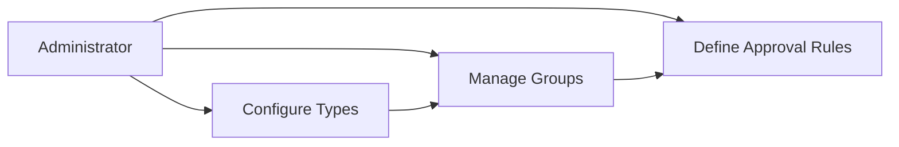
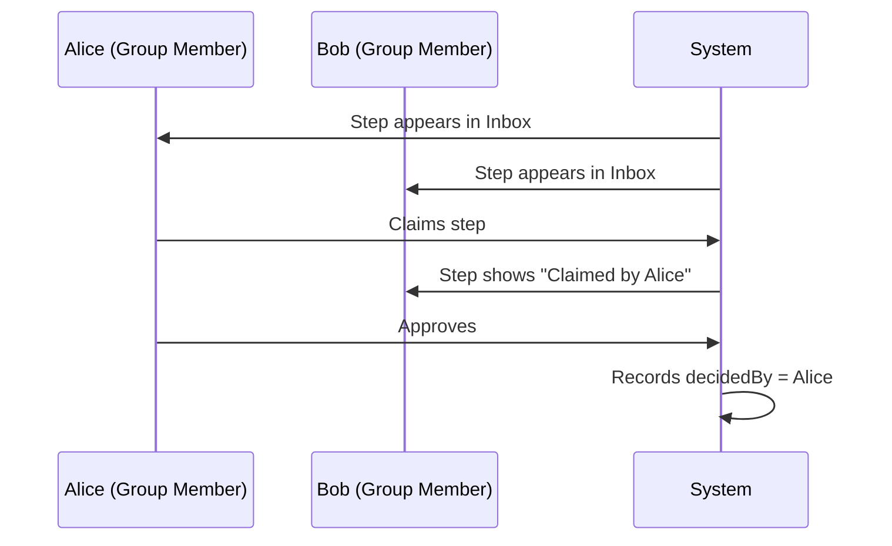

# Administration Guide: Authorization & Roles

> **Audience:** System Administrators, Power Users  
> **Prerequisite:** Access to the **Studio** application  
> **Last Updated:** 2026-01-14

---

## 1. Overview

This guide explains how to configure and manage the **Authorization & Roles** system. As an Administrator, you control:

- **Principal Types** – Enable/disable which entity types (User, Group, Team, Dept) are available
- **Groups** – Create collections of users for approval assignments
- **Members** – Add/remove users from groups
- **Approval Rules** – Assign groups or users to workflow steps



---

## 2. Accessing Organization Management

1. Log in as an **Administrator**
2. Navigate to **Studio** → **Organization**
3. The page has three tabs:
   - **Support Types** – Enable/disable principal types
   - **Users** – View all provisioned users (read-only)
   - **Groups** – Create and manage groups

> [!NOTE]
> Users are automatically provisioned when they first log in (JIT Provisioning). You cannot manually create users – they come from the Identity Provider (SAP IAS/XSUAA).

---

## 3. Managing Support Types

Support Types define which **Principal Types** are available in the system.

### 3.1 Available Types

| Type | Description | Default |
|------|-------------|---------|
| `USER` | Individual user | ✅ Enabled |
| `GROUP` | Generic user group | ✅ Enabled |
| `TEAM` | Working team | ✅ Enabled |
| `DEPARTMENT` | Organizational unit | ✅ Enabled |
| `ROLE` | Functional role (e.g., Auditor) | ✅ Enabled |
| `POSITION` | Org hierarchy position | ❌ Disabled (MVP) |

### 3.2 Enabling/Disabling Types

1. Go to **Studio** → **Organization** → **Support Types** tab
2. Toggle the switch for any type to enable/disable
3. Changes take effect **immediately**

> [!WARNING]
> Disabling a type will **hide** it from dropdowns when creating approval rules, but existing rules using that type will continue to work. Review existing rules before disabling.

---

## 4. Managing Groups

Groups are collections of users. When you assign a group to an approval step, **any member** of that group can complete the approval.

### 4.1 Creating a New Group

1. Go to **Studio** → **Organization** → **Groups** tab
2. Click **+ Create Group**
3. Fill in:
   - **Name**: Descriptive name (e.g., "Finance Approvers")
   - **Type**: Select from enabled types (GROUP, TEAM, DEPARTMENT, ROLE)
   - **Description**: Optional notes
4. Click **Save**

### 4.2 Editing a Group

1. Click on the group row
2. Click **Edit** button
3. Modify name/description
4. Click **Save**

### 4.3 Deleting a Group

1. Click the **⋮** menu on the group row
2. Select **Delete**
3. Confirm in the dialog

> [!CAUTION]
> Deleting a group that is assigned to active approval rules may cause those approvals to fail. Reassign rules before deleting.

---

## 5. Managing Group Members

### 5.1 Adding Members

1. Click on a group to open the **Members Panel**
2. Click **+ Add Member**
3. Search for a user by name or email
4. Click the user to add them
5. Member is added immediately

### 5.2 Removing Members

1. In the **Members Panel**, find the user
2. Click the **✕** button next to their name
3. Member is removed immediately

### 5.3 Best Practices

| ✅ Do | ❌ Don't |
|------|---------|
| Keep groups focused (10-15 members max) | Create groups with 100+ members |
| Use descriptive names | Use abbreviations like "GRP001" |
| Document purpose in description | Leave description empty |
| Review membership quarterly | Set and forget |

---

## 6. Configuring Approval Rules

Once groups are set up, you can assign them to approval rules.

### 6.1 Assigning a Group to an Approval Rule

1. Go to **Studio** → **Request Types** → Select a type
2. Open the **Workflow** tab
3. Click on a step to edit its **Approval Rules**
4. In the rule editor:
   - Set **Approver Type** to the desired type (e.g., DEPARTMENT)
   - In the **Approver** dropdown, select the specific group
5. Click **Save**

### 6.2 How Group Approval Works

When a step is assigned to a **GROUP** (or TEAM, DEPARTMENT, ROLE):

1. **All members** see the pending approval in their inbox
2. **First member to claim** gets exclusive access
3. Claim expires after **4 hours** of inactivity
4. After approval, `decidedBy` field shows who acted



---

## 7. User Visibility Rules (Row-Level Security)

Different users see different requests based on their role:

| User Type | Can See |
|-----------|---------|
| **Requester** | All their own requests |
| **Coordinator** | All requests they are coordinating |
| **Approver** | Requests with steps assigned to them |
| **Step Owner** | Requests with steps they own |
| **Administrator** | All requests |

> [!TIP]
> If a user reports missing requests, verify:
> 1. They are a member of the assigned group
> 2. The request is in a visible status (not DRAFT unless they created it)
> 3. The group membership was created **before** step activation

---

## 8. Troubleshooting

### User Can't See Pending Approval

| Check | Action |
|-------|--------|
| Is user in the assigned group? | Add them via Members Panel |
| Was membership added after step creation? | Re-assign the step |
| Is the group empty? | Add at least one member |

### "Step is claimed by another user" Error

- Steps claimed by another user cannot be edited
- Wait 4 hours for auto-release, or ask the claim holder to release
- **Admin override**: Coordinators and Administrators can force-release

### Approval Rule Not Matching

1. Verify the **Approver Type** is enabled
2. Check the condition expression
3. Ensure the group exists and is active

---

## 9. Glossary

| Term | Definition |
|------|------------|
| **Principal** | Any entity that can be assigned (User or Group) |
| **Shadow User** | Local copy of user from Identity Provider |
| **JIT Provisioning** | Automatic user creation on first login |
| **Claim** | Exclusive lock on a group-assigned step |
| **Coordinator** | Person responsible for managing a request |

---

## 10. Quick Reference

### Keyboard Shortcuts in Groups Panel

| Shortcut | Action |
|----------|--------|
| `Ctrl + N` | New Group |
| `Enter` | Select highlighted item |
| `Esc` | Close panel |

### API Endpoints (for Technical Admins)

```
GET  /admin/ShadowGroups              - List all groups
POST /admin/ShadowGroups              - Create group
GET  /admin/ShadowGroups({ID})/members - List members
POST /admin/ShadowGroups({ID})/members - Add member
```

---

**Document Owner:** Solution Architect  
**Related Docs:** [Solution Design](solution-design.md) | [Task Breakdown](task-breakdown.md)
