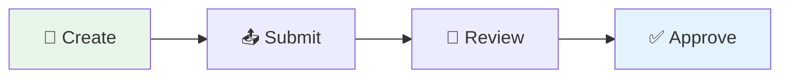

# prorequest - Flexible Request Management

> **🚀 The First AI-Powered Product by conarum GmbH & Co. KG**

---

## Welcome

**prorequest - Flexible Request Management** is conarum's flagship enterprise application, built from the ground up with AI-assisted development. It represents a new era of intelligent workflow automation.

### ✨ What Makes Us Different

| Feature | Traditional Apps | prorequest - Flexible Request Management |
|---------|------------------|----------------------------|
| **Development** | Manual coding | AI-powered engineering |
| **Flexibility** | Fixed workflows | Fully configurable |
| **Intelligence** | Rule-based | Adaptive & smart |
| **Speed** | Months to deploy | Weeks to go-live |

---

## 🎯 What You Can Do

- **Create custom request types** with configurable forms
- **Define multi-step approval workflows** with rules-based routing  
- **Assign approvers** to individuals, groups, or roles
- **Track request status** from submission to completion

---

## 📚 Documentation

### 🚀 Getting Started
- [Introduction](./01-introduction.md) - What is this application?
- [Quick Start](./03-quick-start.md) - Create your first request in 5 minutes

### 📖 User Manual
| Guide | Description |
|-------|-------------|
| [Creating Requests](./04-user-manual/01-creating-requests.md) | How to create and submit requests |
| [Submitting Steps](./04-user-manual/02-submitting-steps.md) | Completing assigned work |
| [Approving Requests](./04-user-manual/03-approving-requests.md) | Review and approve/reject |
| [Managing Teams](./04-user-manual/04-managing-teams.md) | Work with groups |

### 🔐 Security & Access
| Guide | Description |
|-------|-------------|
| [Understanding Roles](./05-security/01-understanding-roles.md) | What each role can do |
| [Visibility Rules](./05-security/02-visibility-rules.md) | Who can see what |

### ⚙️ Administrator Guide
| Guide | Description |
|-------|-------------|
| [Role Management](./06-admin-guide/01-role-management.md) | Setting up roles in SAP BTP |
| [Group Management](./06-admin-guide/02-group-management.md) | Creating and managing groups |
| [Authorization Guide](./06-admin-guide/03-authorization-guide.md) | Complete security setup |

---

## ❓ Need Help?

- [FAQ](./99-faq.md) - Frequently asked questions
- Contact your system administrator for access issues

---

> *Built with ❤️ by conarum GmbH & Co. KG — Powering the Future of Enterprise Workflows*
