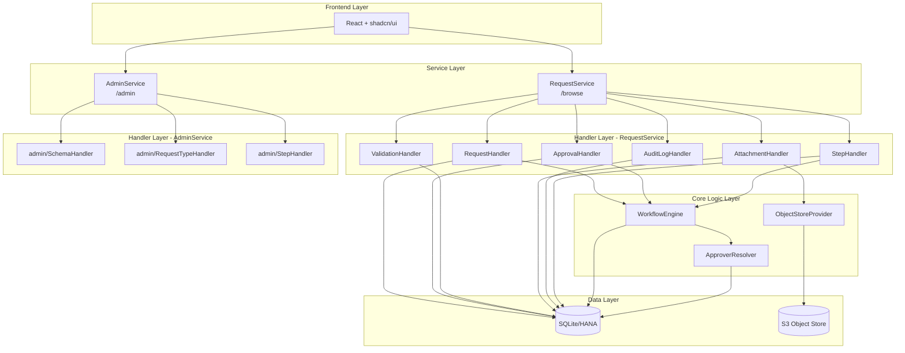
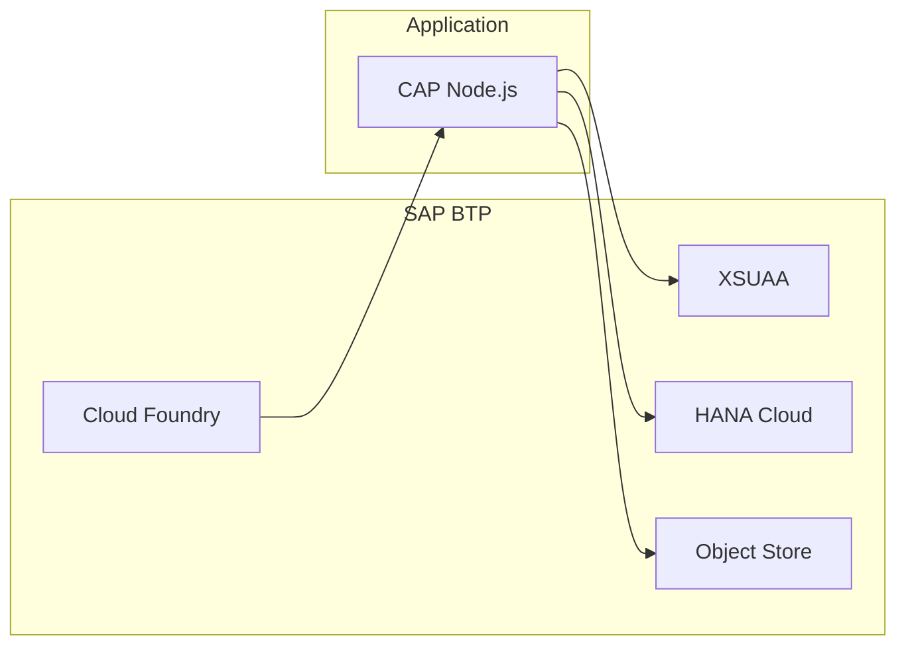

# System Architecture

## Tech Stack

| Layer | Technology |
|-------|------------|
| **Runtime** | SAP CAP (Cloud Application Programming Model) |
| **Language** | TypeScript |
| **Database** | SQLite (local) / SAP HANA (production) |
| **API** | OData V4 |
| **Object Storage** | AWS S3 / SAP BTP Object Store |
| **Authentication** | XSUAA (production) / Mock (local) |

---

## High-Level Architecture



---

## Service Architecture

### RequestService (`/browse`)

Serves end users and approvers. Provides:
- Request CRUD with draft support
- Workflow actions (submit, withdraw)
- Approval actions (approve, reject, sendBack)
- Attachment upload/download

### AdminService (`/admin`)

Serves administrators. Provides:
- RequestType configuration
- StepDefinition management
- Schema definition CRUD
- Clone action for RequestTypes

---

## Handler Pattern

All services use a clean handler pattern:

```
srv/
├── request-service.ts        # Thin entry point
├── admin-service.ts          # Thin entry point
└── handlers/
    ├── RequestHandler.ts     # submit, withdraw, status validation
    ├── ApprovalHandler.ts    # approve, reject, sendBack
    ├── ValidationHandler.ts  # JSON Schema validation
    ├── AttachmentHandler.ts  # S3 pre-signed URLs
    ├── AuditLogHandler.ts    # getAuditLog action
    ├── StepHandler.ts        # submitStep, respondToClarification
    └── admin/
        ├── SchemaHandler.ts       # JSON syntax validation
        ├── RequestTypeHandler.ts  # clone action
        └── StepHandler.ts         # step definition management
```

---

## Core Logic Components

### WorkflowEngine

Handles state transitions:
- Activates start steps on request submit
- Advances to next steps when step completes
- Supports parallel execution via dependencies
- Marks request complete when all steps done

### ApproverResolver

Dynamically determines approvers:
- Evaluates `ApproverRules.conditionExpr` against request data
- Supports operators: eq, ne, gt, lt, contains, in
- Falls back to static config if no rules match

### ObjectStoreProvider

Manages S3/Object Store integration:
- Generates pre-signed URLs for upload/download
- Reads from VCAP_SERVICES (BTP) or env vars (local)
- Supports MinIO for local development

---

## Deployment Architecture


