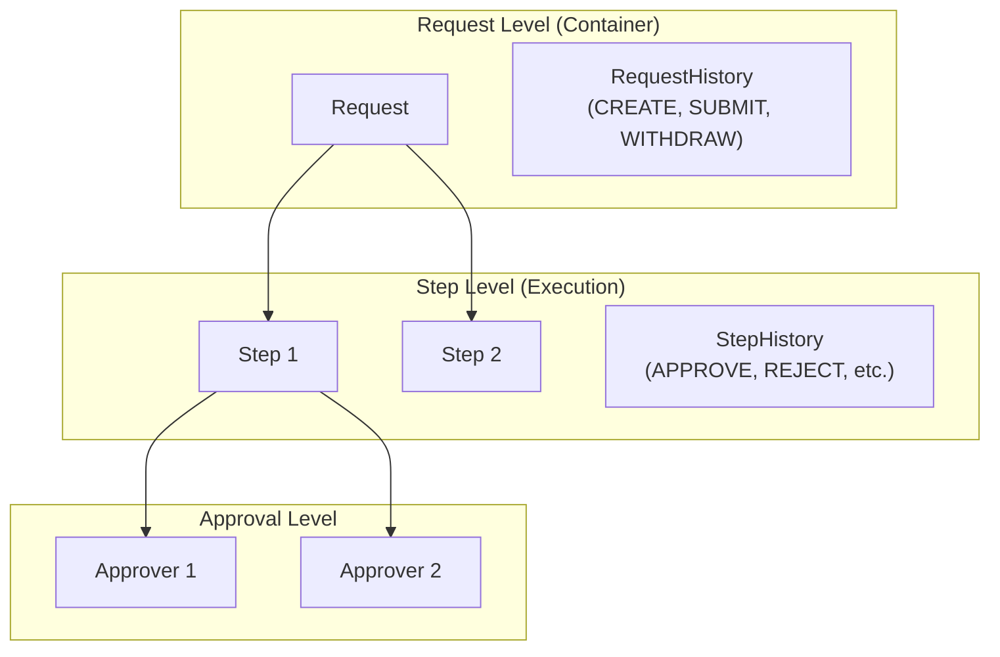
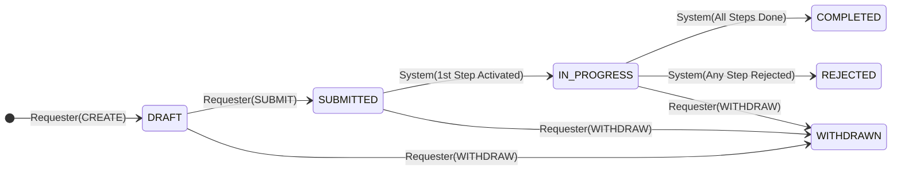
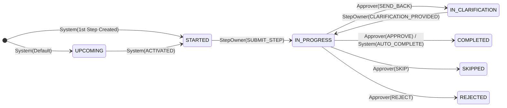

# Workflow Architecture Reference

> **Core Philosophy:** Request = Container | Step = Execution Unit

This document is the single source of truth for understanding the workflow system's statuses, actions, and handler responsibilities.

---

## 1. Architecture Overview



**Key Principles:**
- **Request Status** is derived from the aggregated status of its Steps
- **Actions** (Approve, Reject, Send Back) happen at the **Step** level
- The Request does not "self-approve"—its fate is determined by its Steps

---

## 2. Handler Responsibilities

| Handler | Scope | Actions |
|---------|-------|---------|
| **RequestHandler** | Request lifecycle | `CREATE`, `SUBMIT`, `WITHDRAW` |
| **StepHandler** | Step lifecycle | `submitStep`, `respondToClarification` |
| **ApprovalHandler** | Approver decisions | `APPROVE`, `REJECT`, `SEND_BACK` |
| **WorkflowEngine** | Orchestration | `advance()`, `createApprovals()` |
| **AuditLogHandler** | Read operations | `getAuditLog()` |

---

## 3. Request Statuses

| Status | Meaning | Derived From |
|--------|---------|--------------|
| `DRAFT` | Requester is filling in data. Not yet submitted. | Initial state |
| `SUBMITTED` | Requester clicked "Submit". Workflow is now active. | User action |
| `IN_PROGRESS` | At least one step is actively being worked on. | Any Step is `IN_PROGRESS` or `STARTED` |
| `COMPLETED` | All Steps are `COMPLETED` or `SKIPPED`. | All Steps terminal |
| `REJECTED` | Any single Step is `REJECTED`. | Any Step is `REJECTED` |
| `WITHDRAWN` | Requester cancelled the request. | User action |



---

## 4. Step Statuses

| Status | Meaning |
|--------|---------|
| `UPCOMING` | Waiting for predecessor(s) to complete. |
| `STARTED` | Active for data entry (form filling). |
| `IN_PROGRESS` | Data submitted; awaiting approver decisions. |
| `IN_CLARIFICATION` | Approver requested more information. |
| `COMPLETED` | All required approvals granted. |
| `SKIPPED` | No approval required (or explicitly skipped). |
| `REJECTED` | Approver rejected the step. |



---

## 5. StepApproval Statuses

| Status | Meaning |
|--------|---------|
| `PENDING` | This approver is currently active. |
| `WAITING` | In the queue (sequential approval). |
| `APPROVED` | This approver approved. |
| `REJECTED` | This approver rejected. |
| `SENDBACK` | Sent back for clarification. |
| `REAPPROVAL_NEEDED` | Must re-approve after clarification. |

---

## 6. Action Logging Reference

### Request-Level Actions (→ RequestHistory)

| Action | Handler | Description |
|--------|---------|-------------|
| `CREATE` | RequestHandler | User creates a new request |
| `SUBMIT` | RequestHandler | User submits the request |
| `WITHDRAW` | RequestHandler | User cancels the request |
| `STATUS_CHANGE` | WorkflowEngine | Request status transition (system) |

### Step-Level Actions (→ StepHistory)

| Action | Handler | Description |
|--------|---------|-------------|
| `ACTIVATED` | WorkflowEngine | Step transitions `UPCOMING` → `STARTED` |
| `SUBMIT_STEP` | StepHandler | User submits step data for approval |
| `APPROVE` | ApprovalHandler | Approver approves |
| `REJECT` | ApprovalHandler | Approver rejects |
| `SEND_BACK` | ApprovalHandler | Approver requests clarification |
| `CLARIFICATION_PROVIDED` | StepHandler | User provides clarification |
| `AUTO_COMPLETE` | WorkflowEngine | No approvers → auto-completes |
| `SKIP` | ApprovalHandler | Step not required |

---

## 7. Auto-Complete Behavior

When a step has **no approval rules defined**, it automatically:
1. Transitions to `COMPLETED` immediately
2. Records `AUTO_COMPLETE` in StepHistory
3. Advances workflow to next step
4. Cascades through consecutive no-approver steps

---

## 8. Rejection Handling

**Approach: Hard Rejection**

- When any step is `REJECTED`, the Request status becomes `REJECTED`
- Completed steps remain `COMPLETED` (immutable)
- `UPCOMING` steps are never executed
- Request is final—requester creates a new request if needed

---

## 9. Unified Audit Log

The `getAuditLog()` function merges `RequestHistory` and `StepHistory` into a single chronological view, providing complete visibility into all actions.

```
GET /browse/Requests({ID})/RequestService.getAuditLog()
```

Returns: Unified list sorted by timestamp with source (`REQUEST`/`STEP`) and step names.
