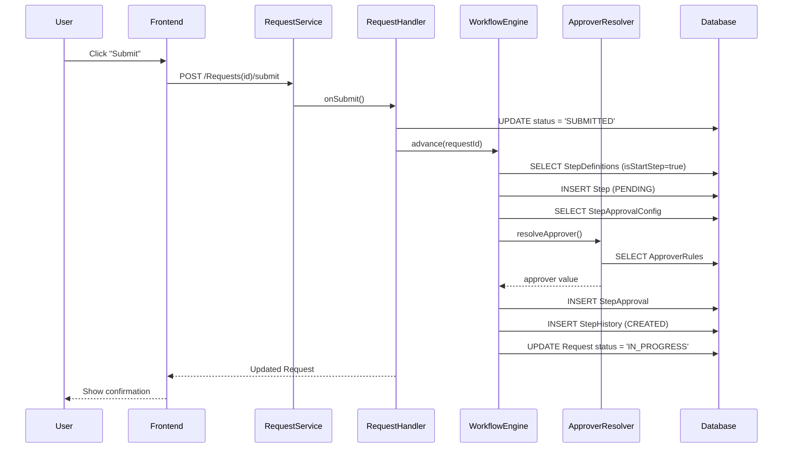
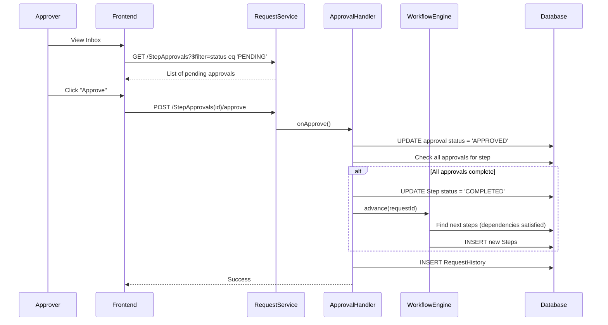
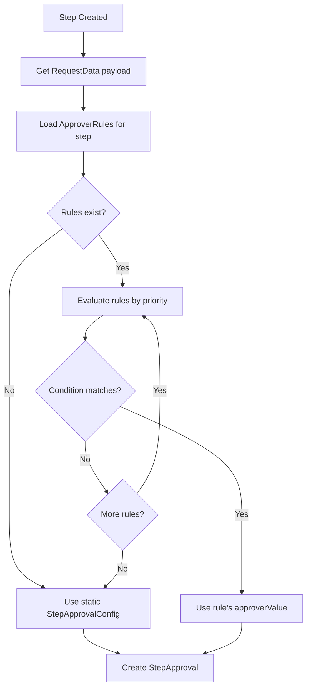
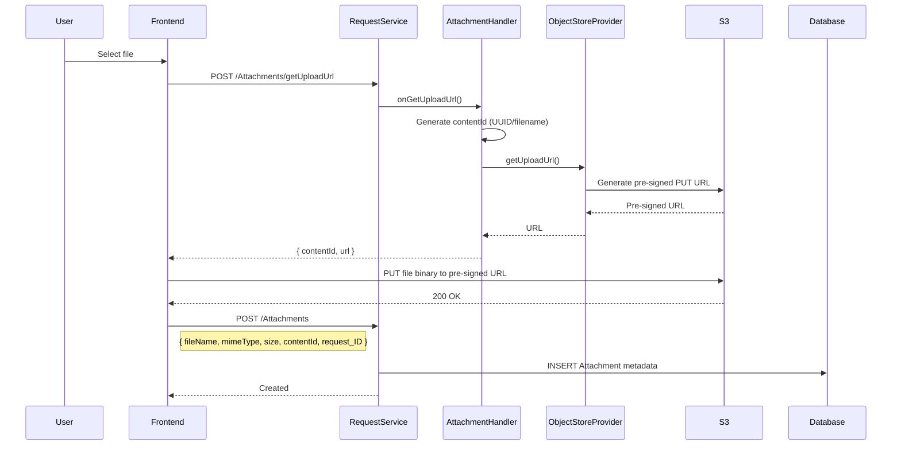
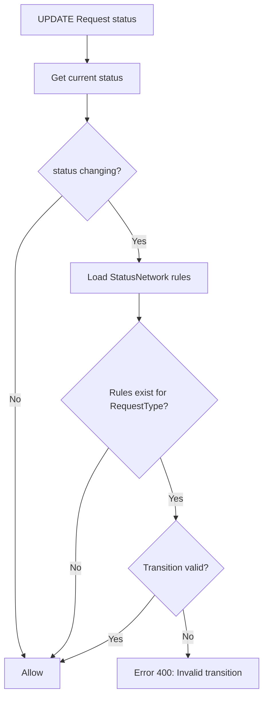
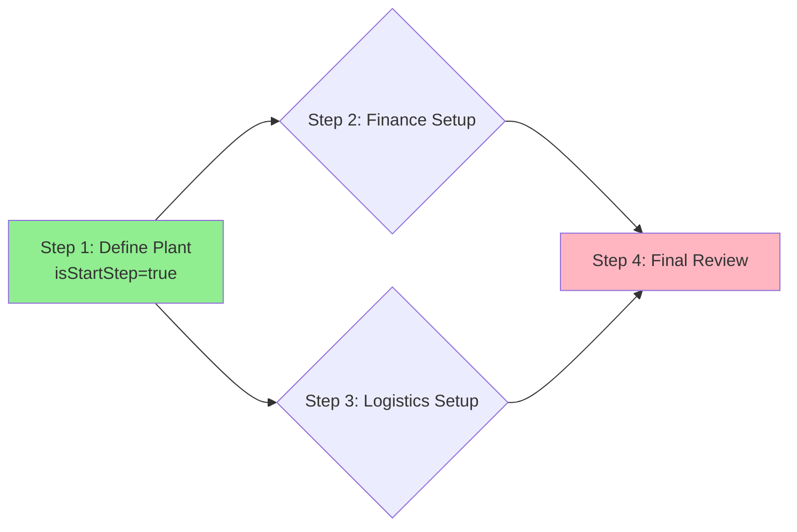

# Data Flow

This document explains how data flows through the system for key operations.

---

## 1. Request Submission Flow



---

## 2. Approval Flow



---

## 3. Dynamic Approver Resolution Flow



### Condition Expression Format

```json
{
  "field": "country",
  "operator": "eq",
  "value": "DE"
}
```

**Supported Operators:**
- `eq` - equals
- `ne` - not equals
- `gt`, `lt`, `gte`, `lte` - comparisons
- `contains` - string contains
- `starts_with` - string starts with
- `ends_with` - string ends with

---

## 4. Attachment Upload Flow



---

## 5. Status Network Validation Flow



### Example Status Network

| From | To | Action |
|------|-----|--------|
| DRAFT | SUBMITTED | submit |
| SUBMITTED | IN_PROGRESS | (auto) |
| SUBMITTED | WITHDRAWN | withdraw |
| IN_PROGRESS | COMPLETED | (auto) |
| IN_PROGRESS | REJECTED | rejectApproval |
| IN_PROGRESS | WITHDRAWN | withdraw |

---

## 6. Step Dependencies Flow



**Execution Logic:**
1. Submit request → Activate all `isStartStep=true` steps
2. When step completes → Find steps where ALL predecessors are COMPLETED
3. When all steps complete → Mark request COMPLETED
