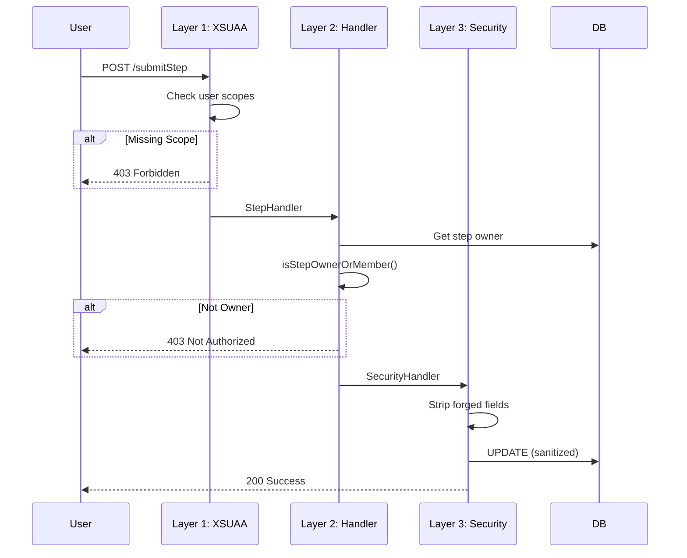

# Security Layers (Defense-in-Depth)

> **Owner:** Tech Lead | **Last Updated:** 2026-01-17 | **Audience:** Developers

This document describes the three-layer security model protecting the application.

---

## Overview

We implement a **defense-in-depth** model with three security layers:

```
┌─────────────────────────────────────────────────────────────┐
│  Layer 1: XSUAA Roles (Global Access Control)               │
│  "Do you have permission to use this feature?"              │
└─────────────────────────────────────────────────────────────┘
                              │
                              ▼
┌─────────────────────────────────────────────────────────────┐
│  Layer 2: Handler Authorization (Dynamic Verification)      │
│  "Are you assigned to THIS specific resource?"              │
└─────────────────────────────────────────────────────────────┘
                              │
                              ▼
┌─────────────────────────────────────────────────────────────┐
│  Layer 3: Field Protection (Attack Surface Reduction)       │
│  "Can you manipulate system-managed fields?"                │
└─────────────────────────────────────────────────────────────┘
```

---

## Layer 1: XSUAA Roles

Global access control via SAP BTP Role Collections.

### Roles

| Role | Scope | Capabilities |
|------|-------|--------------|
| `admin` | Full access | All operations, RLS bypass |
| `Requester` | Create, submit | Create requests, submit steps |
| `Approver` | Approve/reject | Approve, reject, send back |
| `Viewer` | Read-only | View requests (no actions) |

### Implementation

```typescript
// Check in handler
if (!req.user.is('Approver')) {
    return req.error(403, 'Approver role required');
}
```

---

## Layer 2: Handler Authorization

Dynamic check if user is assigned to the specific resource.

### Checks Implemented

| Handler | Check | Method |
|---------|-------|--------|
| `StepHandler` | Is step owner? | `isStepOwnerOrMember()` |
| `ApprovalHandler` | Is assigned approver? | `isAuthorizedApprover()` |
| `CoordinatorHandler` | Is coordinator? | Direct field comparison |

### Implementation

```typescript
// StepHandler.ts
if (!this.isStepOwnerOrMember(req, step)) {
    return req.error(403, 'You are not authorized for this step');
}
```

---

## Layer 3: Field Protection

Prevents manipulation of system-managed fields via direct API calls.

### Protected Fields

| Entity | Field | Protection |
|--------|-------|------------|
| Requests | `delegatedFrom/At` | Always stripped |
| Steps | `claimedBy_ID/At` | Always stripped |
| Steps | `ownerId` | Stripped on UPDATE |
| StepApprovals | `approver` | Always stripped |
| StepApprovals | `decidedBy_ID` | Always stripped |

### Implementation

```typescript
// SecurityHandler.ts
this.srv.before(['CREATE', 'UPDATE'], 'Steps', (req) => {
    delete req.data.claimedBy_ID;
    delete req.data.claimedAt;
});

this.srv.before('UPDATE', 'Steps', (req) => {
    delete req.data.ownerId;  // Immutable after creation
});
```

---

## Request Flow Through All Layers



---

## Related Documents

- [ADR-005: Security Layers](../../project/decisions/005-security-layers.md) - Decision record
- [Roles & Permissions](../../business/roles-permissions.md) - Role matrix
