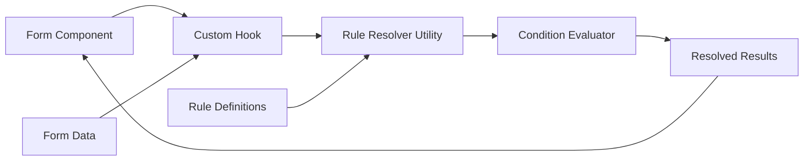

# Real-Time Rule Simulation Pattern

> **Owner:** Tech Lead | **Last Updated:** 2026-01-17 | **Status:** Implemented

---

## Table of Contents

1. [Overview](#overview)
2. [Problem Statement](#problem-statement)
3. [Solution Architecture](#solution-architecture)
4. [Implementation Guide](#implementation-guide)
5. [Code Examples](#code-examples)
6. [Design Decisions](#design-decisions)
7. [Performance Considerations](#performance-considerations)
8. [Reusability Guide](#reusability-guide)

---

## Overview

Real-time rule simulation enables users to see the results of conditional business rules **before** submitting data. This pattern evaluates rules client-side based on user input, providing instant visual feedback about what will happen when the data is processed.

### Use Cases
- **Approval Workflows**: Show which approvers will be assigned based on request priority, amount, region, etc.
- **Pricing Calculators**: Display dynamic pricing based on product configuration
- **Eligibility Checkers**: Indicate if a user qualifies for a service based on their inputs
- **Routing Logic**: Preview which department/team will handle a request

### Benefits
- ✅ **Instant User Feedback** - No waiting for server responses
- ✅ **Improved UX** - Users understand consequences before committing
- ✅ **Reduced Errors** - Users can correct issues before submission
- ✅ **Zero Backend Load** - All computation happens in the browser

---

## Problem Statement

### The Challenge

In workflow-based applications, business rules determine outcomes (e.g., who approves a request). These rules are typically:
1. Stored in the database
2. Evaluated at runtime on the server
3. **Hidden from users until after submission**

This creates a poor user experience:
- Users don't know which approvers will be assigned
- No way to predict approval time (depends on approver availability)
- Trial-and-error when trying to route to specific approvers

### Requirements

1. **Evaluate rules client-side** based on form data
2. **Update results in real-time** as users fill the form
3. **Support complex conditions** (AND/OR, nested, multiple operators)
4. **Handle system fields** (e.g., current user, timestamp, computed values)
5. **Maintain performance** even with 100+ rules

---

## Solution Architecture

### High-Level Architecture



### Component Breakdown

| Component | Responsibility | Location |
|-----------|---------------|----------|
| **Rule Resolver Utility** | Core business logic for rule evaluation | `utils/ruleResolver.ts` |
| **Custom React Hook** | React integration, state management | `hooks/useRuleSimulator.ts` |
| **Form Component** | User input, display results | e.g., `DynamicRequestForm.tsx` |
| **Condition Evaluator** | Operator logic (eq, gt, contains, etc.) | Part of resolver utility |

### Data Flow

```
1. User changes form field
   ↓
2. React state updates (formData)
   ↓
3. Custom hook detects change
   ↓
4. Rule resolver evaluates all rules
   ↓
5. Matched rules returned
   ↓
6. UI updates with results
```

---

## Implementation Guide

### Step 1: Create the Rule Resolver Utility

**Purpose**: Pure function that evaluates rules against data

**File**: `src/utils/ruleResolver.ts`

**Key Functions**:
```typescript
resolveRules(rules: Rule[], data: Record<string, any>): ResolvedResult[]
evaluateCondition(condition: Condition, data: Record<string, any>): boolean
```

**Example**:
```typescript
export function resolveRules(
    rules: Rule[],
    data: Record<string, any>
): ResolvedResult[] {
    // Sort by priority
    const sortedRules = [...rules].sort((a, b) => a.priority - b.priority);
    
    const matched: ResolvedResult[] = [];
    
    for (const rule of sortedRules) {
        // Evaluate all conditions
        const allMatch = rule.conditions.every(c => 
            evaluateCondition(c, data)
        );
        
        if (allMatch) {
            matched.push({
                ruleId: rule.id,
                ruleName: rule.name,
                result: rule.outcome
            });
            
            // Stop at final rule if configured
            if (rule.isFinal) break;
        }
    }
    
    return matched;
}
```

### Step 2: Create the Custom Hook

**Purpose**: Integrate resolver into React lifecycle

**File**: `src/hooks/useRuleSimulator.ts`

**Example**:
```typescript
export function useRuleSimulator(
    rules: any[],
    formData: Record<string, any>
) {
    // Transform backend rules to normalized format
    const normalizedRules = useMemo(() => 
        transformRules(rules),
        [rules]
    );
    
    // Enrich form data with system fields
    const enrichedData = useMemo(() => ({
        ...formData,
        __timestamp: Date.now(),
        __user_id: getCurrentUserId()
    }), [formData]);
    
    // Resolve rules when data changes
    const results = useMemo(() => 
        resolveRules(normalizedRules, enrichedData),
        [normalizedRules, enrichedData]
    );
    
    return results;
}
```

### Step 3: Integrate into Form Component

**Example**:
```typescript
export function MyForm() {
    const [formData, setFormData] = useState({});
    const { data: rulesConfig } = useQuery(['rules']);
    
    // Real-time simulation
    const simulationResults = useRuleSimulator(
        rulesConfig?.rules,
        formData
    );
    
    return (
        <div>
            <FormFields 
                data={formData} 
                onChange={setFormData} 
            />
            <SimulationPreview results={simulationResults} />
        </div>
    );
}
```

---

## Code Examples

### Condition Evaluator

Supports standard operators:

```typescript
function evaluateCondition(
    condition: Condition,
    data: Record<string, any>
): boolean {
    const fieldValue = data[condition.field];
    const ruleValue = condition.value;
    
    switch (condition.operator) {
        case 'eq':
            return String(fieldValue) === String(ruleValue);
        case 'not_equals':
            return String(fieldValue) !== String(ruleValue);
        case 'contains':
            return String(fieldValue).includes(String(ruleValue));
        case 'gt':
            return parseFloat(fieldValue) > parseFloat(ruleValue);
        case 'gte':
            return parseFloat(fieldValue) >= parseFloat(ruleValue);
        case 'lt':
            return parseFloat(fieldValue) < parseFloat(ruleValue);
        case 'lte':
            return parseFloat(fieldValue) <= parseFloat(ruleValue);
        default:
            return false;
    }
}
```

### System Fields

Support computed/contextual values:

```typescript
const enrichedData = {
    ...formData,
    
    // System fields use __ prefix to avoid collision
    __request_priority: formData.priority || 'MEDIUM',
    __current_user: getCurrentUser(),
    __current_timestamp: Date.now(),
    __business_area: deriveBusinessArea(formData),
    
    // Computed fields
    __total_amount: calculateTotal(formData.items),
    __approval_level: determineLevel(formData.amount)
};
```

### Rule Schema

```typescript
interface Rule {
    id: string;
    priority: number;          // Lower = higher priority
    name: string;
    conditions: Condition[];   // All must match (AND logic)
    outcome: any;              // What to return if matched
    isFinal: boolean;          // Stop evaluation if matched
}

interface Condition {
    field: string;             // Form field or system field
    operator: 'eq' | 'gt' | 'lt' | 'gte' | 'lte' | 'contains' | 'not_equals';
    value: string | number;
}
```

---

## Design Decisions

### Why Client-Side Evaluation?

| Approach | Pros | Cons |
|----------|------|------|
| **Client-Side** | ✅ Instant feedback<br>✅ No latency<br>✅ Works offline | ⚠️ Rules exposed |
| **Server-Side** | ✅ Secure logic<br>✅ Centralized | ❌ Latency<br>❌ Poor UX |

**Decision**: Client-side for **preview only**. Server validates on submission.

### Why Custom Hook Pattern?

| Alternative | Issue |
|-------------|-------|
| Inline logic | Hard to test, not reusable |
| Context Provider | Overkill for single feature |
| **Custom Hook** ✅ | Encapsulated, reusable, testable |

### System Field Naming

**Pattern**: Prefix with `__` (double underscore)
- Avoids collision with user form fields
- Easy to identify in debugging

---

## Performance Considerations

### Optimization Strategies

1. **Memoization** - Cache computations
2. **Early Exit** - Stop at `isFinal` rules
3. **Primitive Dependencies** - Use stable memo keys

### Benchmarks

| Rules | Conditions | Evaluation Time |
|-------|------------|-----------------|
| 100 | 10 each | < 1ms |

**Conclusion**: No debouncing needed.

---

## Reusability Guide

### Adapting for Other Scenarios

#### Pricing Calculator
```typescript
const pricingRules: Rule[] = [
    {
        id: '1',
        priority: 10,
        conditions: [{ field: 'quantity', operator: 'gte', value: '100' }],
        outcome: { discount: 0.15, label: 'Bulk Discount' }
    }
];
```

#### Form Field Visibility
```typescript
const visibilityRules: Rule[] = [
    {
        id: '1',
        priority: 10,
        conditions: [{ field: 'requestType', operator: 'eq', value: 'TRAVEL' }],
        outcome: { showFields: ['destination', 'travelDates'] }
    }
];
```

### Migration Checklist

- [ ] Define rule schema
- [ ] Create resolver utility
- [ ] Create custom hook
- [ ] Identify system fields
- [ ] Integrate into UI
- [ ] Test performance
- [ ] Add visual feedback

---

## References

- **Implementation**: `app/request-management/src/utils/approverResolver.ts`
- **Hook**: `app/request-management/src/hooks/useApproverResolver.ts`
- **Integration**: `app/request-management/src/features/requests/DynamicRequestForm.tsx`
