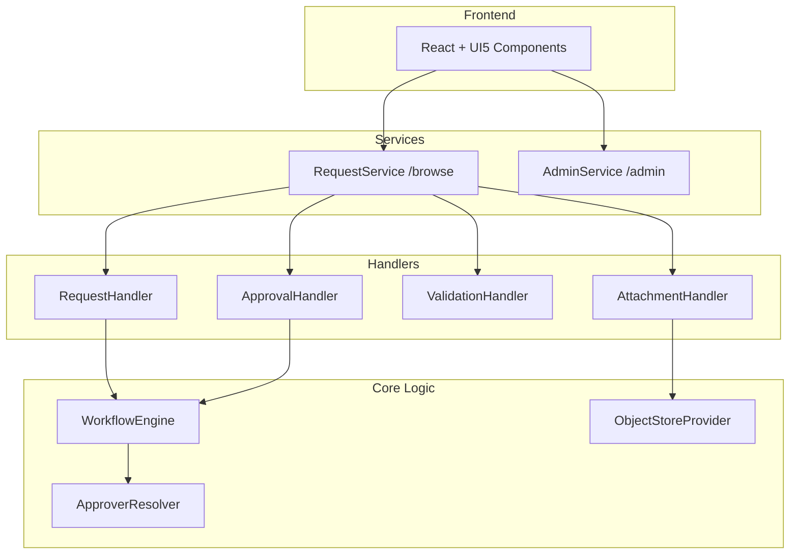
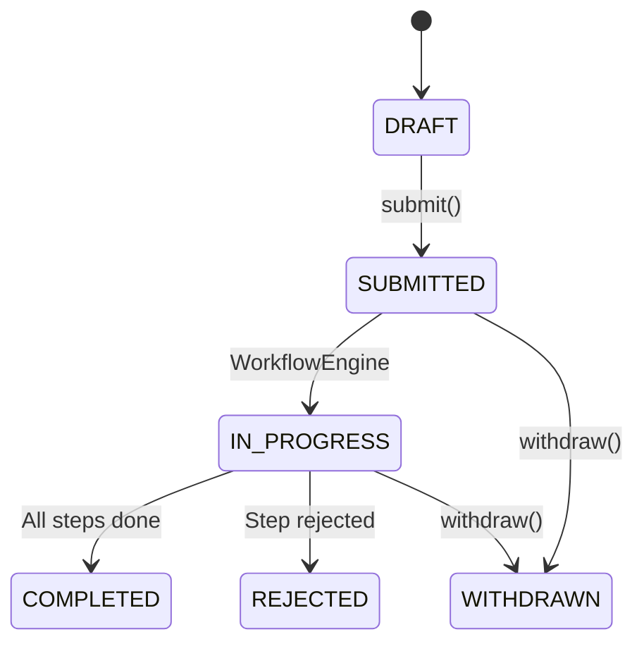
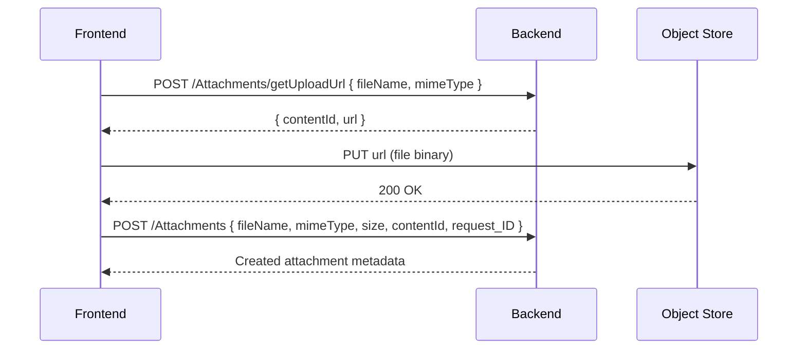

# Backend API Handoff for Frontend Development

**Target Audience:** Lead Frontend Engineer  
**Backend Stack:** SAP CAP, TypeScript, OData V4  
**Base URLs:**
- Local: `http://localhost:4004`
- RequestService: `/browse`
- AdminService: `/admin` (requires `admin` role)

---

## 1. Architecture Overview



---

## 2. Entity Schemas

### Configuration Entities (Read-Only for End Users)

| Entity | Purpose | Key Fields |
|--------|---------|------------|
| `RequestTypes` | Request type catalog | `title`, `description` |
| `StepDefinitions` | Steps in a workflow | `stepName`, `sequenceNum`, `isStartStep`, `slaDays` |
| `StepApprovalConfig` | Approval chain config | `sequenceNum`, `approverRole` |
| `SchemaDefinitions` | JSON Schema for forms | `title`, `content` (JSON) |
| `StatusNetwork` | Valid status transitions | `fromStatus`, `toStatus`, `action` |
| `ApproverRules` | Dynamic approver rules | `conditionExpr`, `approverType`, `approverValue` |

### Runtime Entities (CRUD)

| Entity | Purpose | Key Fields |
|--------|---------|------------|
| `Requests` | User request instances | `title`, `status`, `priority`, `requestType_ID` |
| `Steps` | Runtime step instances | `status`, `dueDate`, `stepDefinition_ID` |
| `StepApprovals` | Approval task items | `approver`, `status`, `comment`, `decisionAt` |
| `RequestData` | Step form data (JSON) | `payload` (JSON string) |
| `Attachments` | File metadata | `fileName`, `mimeType`, `size`, `contentId` |

### Audit Entities (Read-Only)

| Entity | Purpose | Navigation |
|--------|---------|------------|
| `RequestHistory` | Request-level audit log | `Requests(id)/history` |
| `StepHistory` | Step-level audit log | `Steps(id)/history` |

---

## 3. Request Status Flow



**Status Values:** `DRAFT`, `SUBMITTED`, `IN_PROGRESS`, `COMPLETED`, `REJECTED`, `WITHDRAWN`

---

## 4. API Actions

### RequestService Actions

| Action | Entity | Method | Description |
|--------|--------|--------|-------------|
| `submit()` | Requests | POST | Transitions DRAFT → SUBMITTED, starts workflow |
| `withdraw()` | Requests | POST | Cancels request (not if COMPLETED) |
| `approve(comment)` | StepApprovals | POST | Approves current step |
| `rejectApproval(comment)` | StepApprovals | POST | Rejects step, may reject request |
| `sendBack(comment, targetStepId)` | StepApprovals | POST | Sends back to previous step |
| `getUploadUrl(fileName, mimeType)` | Attachments | POST | Returns `{ contentId, url }` for S3 upload |
| `getDownloadUrl()` | Attachments | GET | Returns pre-signed S3 download URL |

### AdminService Actions

| Action | Entity | Method | Description |
|--------|--------|--------|-------------|
| `clone()` | RequestTypes | POST | Duplicates RequestType with all steps |

---

## 5. OData Query Examples

```javascript
// TanStack Query example patterns

// Get all request types
GET /browse/RequestTypes

// Get requests with expansion
GET /browse/Requests?$expand=requestType,steps($expand=approvals)

// Get pending approvals for current user
GET /browse/StepApprovals?$filter=approver eq 'alice' and status eq 'PENDING'

// Get step history
GET /browse/Steps({stepId})/history?$orderby=timestamp desc

// Submit a request
POST /browse/Requests({id},IsActiveEntity=true)/RequestService.submit

// Approve with comment
POST /browse/StepApprovals({id})/RequestService.approve
Body: { "comment": "Looks good" }
```

---

## 6. Attachment Upload Flow



---

## 7. Draft Pattern (Important!)

CAP uses OData Draft handling for `Requests`:

1. **Create Draft:** `POST /browse/Requests` → Returns `IsActiveEntity=false`
2. **Edit Draft:** `PATCH /browse/Requests(ID={id},IsActiveEntity=false)`
3. **Activate:** `POST /browse/Requests(ID={id},IsActiveEntity=false)/draftActivate`
4. **Active Entity:** `IsActiveEntity=true`

---

## 8. Frontend Apps to Build

| App | Users | Features |
|-----|-------|----------|
| **My Requests** | End Users | Create request, view status, submit, withdraw |
| **Approver Inbox** | Approvers | Worklist of pending approvals, approve/reject/sendBack |
| **Admin Studio** | Admins | Configure RequestTypes, steps, schemas, rules |

---

## 9. JSON Schema for Forms

`SchemaDefinitions.content` contains JSON Schema (Draft 07):

```json
{
  "$schema": "http://json-schema.org/draft-07/schema#",
  "type": "object",
  "properties": {
    "plantName": { "type": "string", "title": "Plant Name" },
    "country": { "type": "string", "enum": ["DE", "US", "CN"] },
    "capacity": { "type": "integer", "minimum": 0 }
  },
  "required": ["plantName", "country"]
}
```

**Recommendation:** Use `react-jsonschema-form` or similar for dynamic form rendering.

---

## 10. Environment Setup

```bash
# Start backend locally
cds watch

# API will be available at:
# - http://localhost:4004/browse (RequestService)
# - http://localhost:4004/admin (AdminService)

# Default users (mocked auth):
# - alice:alice (user)
# - bob:bob (admin)
```

---

## 11. Key Files Reference

| File | Purpose |
|------|---------|
| `srv/request-service.cds` | RequestService definition |
| `srv/admin-service.cds` | AdminService definition |
| `db/schema.cds` | All entity schemas |
| `db/data/*.csv` | Seed data |
| `docs/05-core-components.md` | Entity documentation |
| `docs/workflow-architecture.md` | Workflow status reference |
