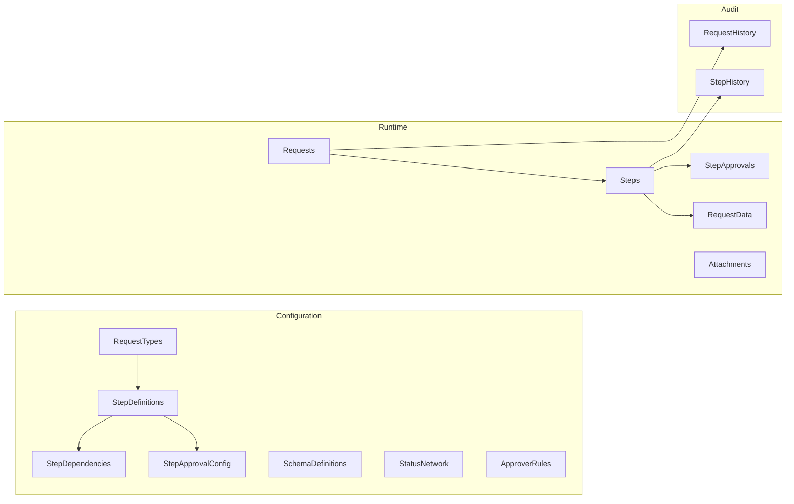

# Core Components - Domain Model

This document provides a deep dive into the 14 entities that make up the Flexible Request Management System.

---

## Entity Categories



---

## Configuration Entities

### RequestTypes

Blueprint for a type of request (e.g., "New Plant Governance", "Leave Request").

| Field | Type | Description |
|-------|------|-------------|
| `ID` | UUID | Primary key |
| `title` | String | Display name |
| `description` | String | Detailed description |
| `steps` | Composition | Child StepDefinitions |

**Example:**
```json
{
  "ID": "RT_NEW_PLANT",
  "title": "New Plant Governance",
  "description": "Multi-step process for creating a new manufacturing plant"
}
```

---

### StepDefinitions

Defines a step within a workflow.

| Field | Type | Description |
|-------|------|-------------|
| `stepName` | String | Display name |
| `sequenceNum` | Integer | For display ordering |
| `isStartStep` | Boolean | True if activates on submit |
| `slaDays` | Integer | Days to complete (default 3) |
| `schemaDefinition` | Association | JSON Schema for form |
| `predecessors` | Composition | StepDependencies |
| `approvalConfig` | Composition | StepApprovalConfig |

---

### StepDependencies

Defines which steps must complete before another can start.

| Field | Type | Description |
|-------|------|-------------|
| `step` | Association | This step... |
| `dependsOn` | Association | ...waits for this step |

**Example:** Finance Setup depends on Define Plant completing:
```json
{
  "step_ID": "STEP_FINANCE",
  "dependsOn_ID": "STEP_DEFINE_PLANT"
}
```

---

### StepApprovalConfig

Defines the approval chain for a step.

| Field | Type | Description |
|-------|------|-------------|
| `sequenceNum` | Integer | Approval order (1, 2, 3...) |
| `approverRole` | String | Role name (e.g., "OpsManager") |

**Example:** Step with 2 sequential approvals:
```json
[
  { "sequenceNum": 1, "approverRole": "OpsDirector" },
  { "sequenceNum": 2, "approverRole": "VPManufacturing" }
]
```

---

### SchemaDefinitions

Stores JSON Schema (Draft 07) for validating step data.

| Field | Type | Description |
|-------|------|-------------|
| `title` | String | Schema name |
| `content` | LargeString | JSON Schema content |

**Example:**
```json
{
  "title": "Plant Definition Schema",
  "content": "{\"type\":\"object\",\"properties\":{\"plantName\":{\"type\":\"string\"},\"country\":{\"type\":\"string\",\"enum\":[\"DE\",\"US\",\"CN\"]}}}"
}
```

---

### StatusNetwork

Defines valid status transitions for a RequestType.

| Field | Type | Description |
|-------|------|-------------|
| `fromStatus` | String | Current status |
| `toStatus` | String | Target status |
| `action` | String | Triggering action |

**Example transitions:**
```
DRAFT → SUBMITTED (via submit action)
SUBMITTED → IN_PROGRESS (automatic)
IN_PROGRESS → COMPLETED (automatic)
```

---

### ApproverRules

Decision table for dynamic approver resolution.

| Field | Type | Description |
|-------|------|-------------|
| `priority` | Integer | Higher = evaluated first |
| `conditionExpr` | LargeString | JSON condition |
| `approverType` | Enum | USER, ROLE, GROUP |
| `approverValue` | String | The approver identifier |

**Example:** German plants go to DE Finance Team:
```json
{
  "priority": 10,
  "conditionExpr": "{\"field\":\"country\",\"operator\":\"eq\",\"value\":\"DE\"}",
  "approverType": "GROUP",
  "approverValue": "DE_FINANCE_TEAM"
}
```

---

## Runtime Entities

### Requests

Instance of a request created by a user.

| Field | Type | Description |
|-------|------|-------------|
| `title` | String | User-provided title |
| `requestType` | Association | The blueprint |
| `priority` | Enum | HIGH, MEDIUM, LOW |
| `status` | Enum | DRAFT, SUBMITTED, IN_PROGRESS, COMPLETED, REJECTED, WITHDRAWN |
| `steps` | Composition | Child Steps |
| `history` | Composition | Child RequestHistory |

---

### Steps

Runtime instance of a step within a request.

| Field | Type | Description |
|-------|------|-------------|
| `stepDefinition` | Association | The blueprint |
| `status` | Enum | PENDING, IN_PROGRESS, COMPLETED, REJECTED, SKIPPED |
| `dueDate` | Timestamp | SLA deadline |
| `reminderSent` | Boolean | True if reminder sent |
| `approvals` | Composition | Child StepApprovals |
| `data` | Composition | Child RequestData |
| `history` | Composition | Child StepHistory |

---

### StepApprovals

Tracks approval decisions within a step.

| Field | Type | Description |
|-------|------|-------------|
| `sequenceNum` | Integer | Order in approval chain |
| `approver` | String | Assigned approver |
| `status` | Enum | PENDING, APPROVED, REJECTED |
| `comment` | String | Decision comment |
| `decisionAt` | Timestamp | When decided |

---

### RequestData

Stores the business data payload for a step.

| Field | Type | Description |
|-------|------|-------------|
| `step` | Association | Parent step |
| `payload` | LargeString | JSON data blob |

---

### Attachments

Stores file metadata (binary in S3).

| Field | Type | Description |
|-------|------|-------------|
| `fileName` | String | Original file name |
| `mimeType` | String | MIME type |
| `size` | Integer64 | Size in bytes |
| `contentId` | String | S3 key |
| `request` | Association | Parent request |
| `step` | Association | Optional parent step |

---

## Audit Entities

### RequestHistory

Immutable log of request-level events.

| Field | Type | Description |
|-------|------|-------------|
| `action` | String | SUBMIT, APPROVE, REJECT, UPDATE |
| `actor` | String | User ID |
| `timestamp` | Timestamp | When occurred |
| `comment` | String | Optional comment |
| `snapshot` | LargeString | Data snapshot |

---

### StepHistory

Granular step-level audit log.

| Field | Type | Description |
|-------|------|-------------|
| `action` | Enum | CREATED, ACTIVATED, DATA_UPDATED, STATUS_CHANGED, SLA_BREACHED, APPROVAL_STARTED, SENT_BACK |
| `fromValue` | String | Previous value |
| `toValue` | String | New value |
| `actor` | String | User ID (null for system) |
